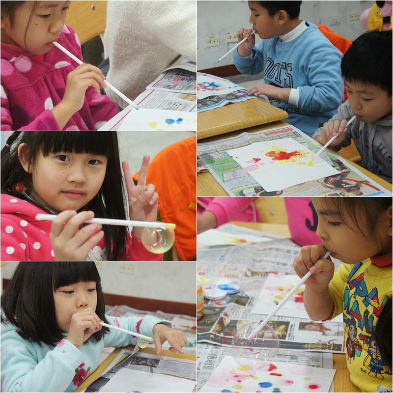
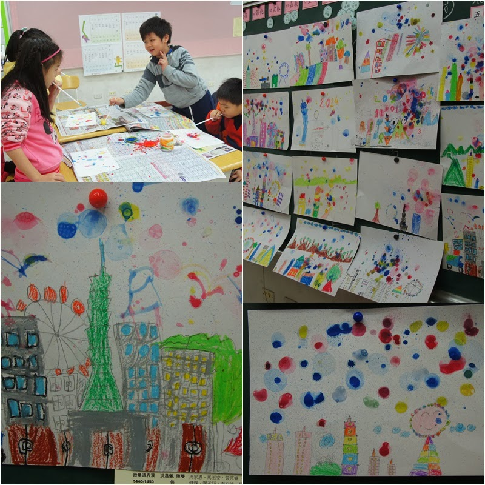
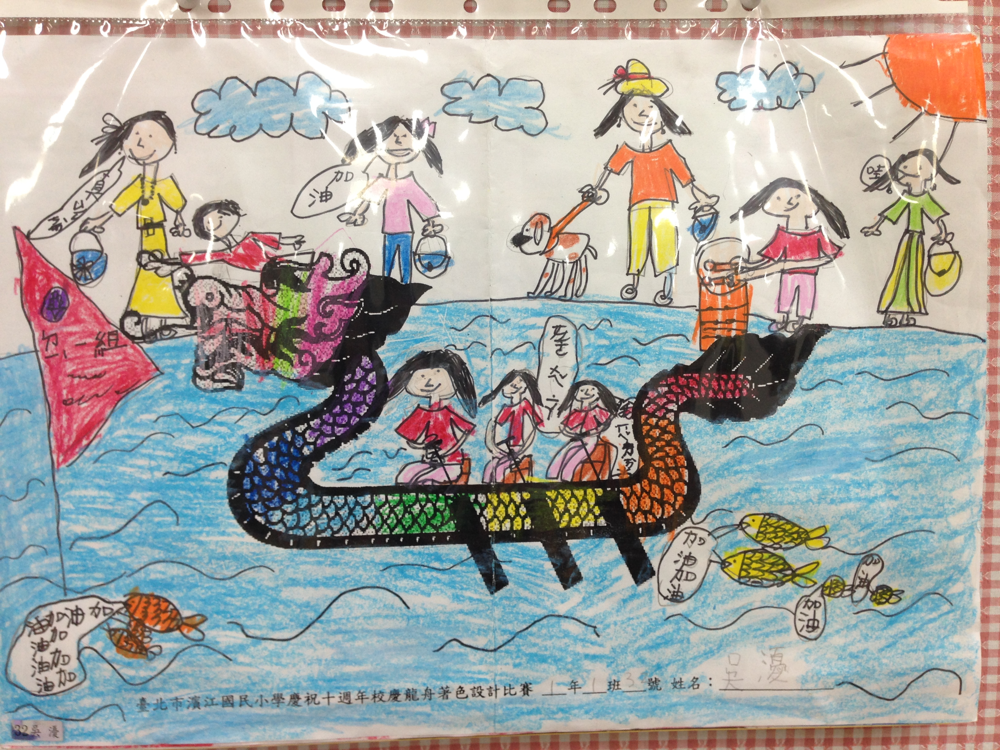
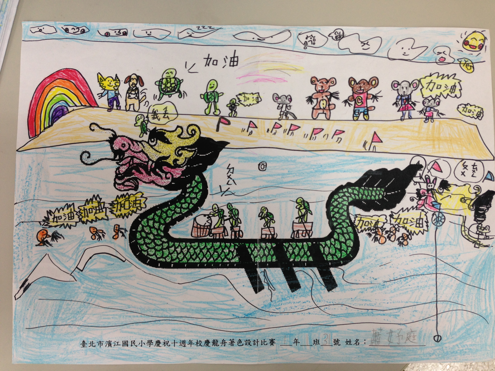
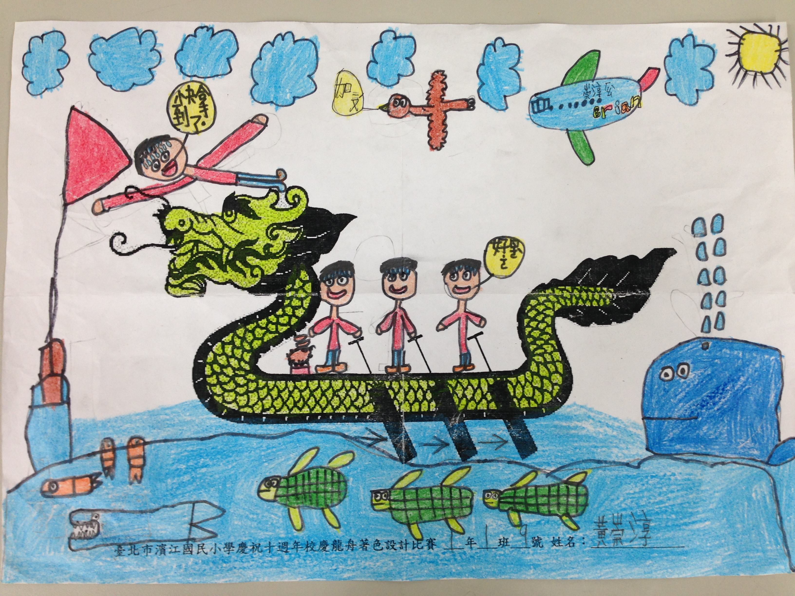
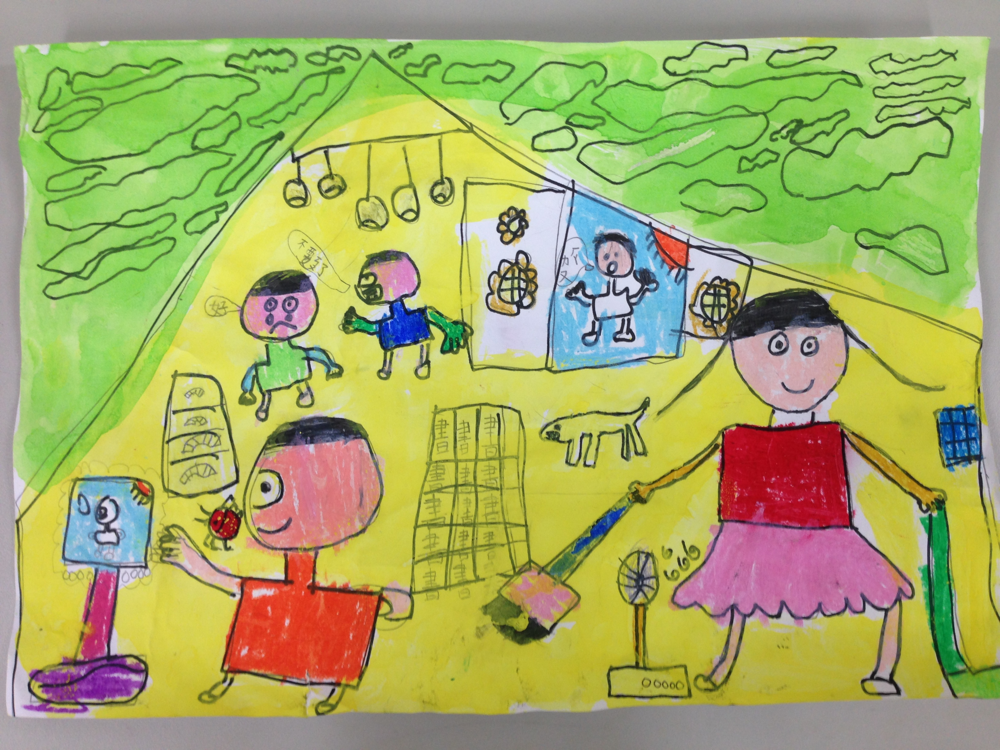

========
一年一班
========

廖瑞珍老師的話
==============

幸福的災難日 - 吹泡泡畫
-----------------------

預告了好久，終於在今日進行孩子們最喜歡、最期待的－吹泡泡畫！！

孩子的快樂，就是老師的災難。

想讓他們玩個過癮，材料怎麼發、怎麼收，不會真的釀成災，在在考驗師生間的默契。忙碌如我，又想多拍幾張孩子們活動的相片，又必須游走各組進行個別指導，還得適時的給予顏料補給；最後散場前，像極了火鍋店小妹，拿個大桶子，讓孩子們把顏料盤、吸管等容易弄髒地面的工具一一收拾。再請各組把報紙回收，終於大功告成啦！

不過，回到家，爸媽們可不要嚇一跳喔！孩子們純淨的臉龐，各個都成了大花臉啦！繽紛泡泡吹在畫紙上，也綻放在快樂的小臉蛋上！又再一次完成了不可能的任務。耶～～

主題寫作：園遊會
================

<學校的園遊會> 呂彥寧
---------------------

五月三日星期六是濱江國小的園遊會，我好高興啊！因為這天是最棒最棒的一天！

我看到大排長龍的隊伍令人食指大動的想吃蔥油餅，可是輪到我時卻賣完了，真可惜！我還玩了很多遊戲，有橡皮筋槍，還有套圈圈，真開心！

我好期待明年的園遊會，一定會更好玩的！

<快樂的園遊會> 林恩約
---------------------

園遊會開始之前，老師介紹了很多遊戲，看起來都好好玩喔！

一開始，我先去玩憤怒鳥。我覺得它就像一顆子彈一樣射過去，結果被我射中了，我好開心！我得到了好吃的冰棒。我還去玩乒乓球，得到七分，獎品是一隻超大的黑熊。

我覺得大哥哥、大姐姐設計的每一個遊戲，都會讓我二話不說的跑過去排隊，因為真的都很好玩。

<熱鬧的園遊會> 戴維里
---------------------

我期待的園遊會終於來了！我好開心啊！一早老師先帶我們去參觀繞了一圈，讓我們知道各個攤位的情況。

我們先集合看完開幕式的表演後，園遊會就開始了。我玩了套圈圈，還有自己設計用橡皮筋串手環，這也是我最愛的遊戲。我還喝了乾冰汽水，冰冰涼涼的汽水好像在我的肚子裡跳舞。

我覺得一年只有一次園遊會實在不夠，希望一年可以辦十次！

主題寫作：放大鏡下的校園小動物
==============================

<觀察日記> 王均睿
-----------------

前天我們帶著昆蟲箱到操場捕捉昆蟲，在過程中，我們到操場最邊邊的角落尋找昆蟲。我們發現數量很多，種類也很多。

我們這組抓到兩種顏色的椿象，仔細觀察後，再把牠畫下來。我覺得這堂課十分有趣。

<觀察日記> 溫致威
-----------------

我在學校觀察小動物，看到了椿象、蚯蚓和甲蟲。我最喜歡甲蟲，因為甲蟲的生命力很強大，也很好飼養，但是牠很難找，弄得我的手都髒了。

我覺得濱江國小真的有許多小動物等著我們去發現呢！

小日記
======

呂尚哲
------

這個周末，舅舅帶著表弟從台南來我們家玩。表弟很可愛，他比我的妹妹小一歲。他看到我們家的鋼琴很有興趣，等他長大一點，我就可以教他彈鋼琴。

張可璇
------

星期六早餐時間，我們點了涼麵及蛋花湯，再走路去行天宮拜拜。下午，爸爸帶我們打保齡球，假日很多人在打球，大家都很厲害，一起運動真快樂。

王寶嬅
------

星期六的時候，我學會仰漂。全身放鬆，只有脖子靠著媽媽的手，手腳輕輕擺動，可以在水中漂浮很久。我感覺，我像魚一樣自在。

吳瀀
----

這個星期六，我和媽媽還有吳慮一起去內湖運動公園玩。我們先到攀岩場攀岩，然後媽媽帶我們去親水區玩。我看到一些水黽，牠們在水上跑得好快喔！我覺得那是表面張力。

春天童詩創作
============

<彩色世界> 盧敬儐
-----------------

::
    
    春天在哪裡？在美麗的花園叫醒種子開花。
    春天在哪裡？在森林幫大樹換新帽。
    春天在哪裡？
    在大自然裡施展魔法，變成百花盛開的花花世界。
    我想對春天說：我希望再次見到你！
 

<繽紛的春天> 謝睿軒
-------------------

::
    
    春天在哪裡？在花園幫蝴蝶縫新衣。
    春天在哪裡？在森林裡舉辦音樂。
    春天在哪裡？
    在大自然裡施展魔法，變出五彩繽紛的彩色世界。
    我想對春天說：謝謝你帶給我們温暖的世界。
  
<春天在花園裡> 王崇銘
---------------------

::
    
    春天在那裡？在漂亮的郊外裡叫醒種子。
    春天在那裡？在操場幫蜜蜂收集花蜜。
    春天在那裡？
    在大自然施展魔術，漂亮新的世界。
    我想對春天說：謝謝你帶來五顏六色的世界。
   
<舒服的春天> 徐詠之
-------------------

::
    
    春天在哪裡？在美麗的花園忙著幫蝴蝶換新衣，
    春天在哪裡？在黑暗的樹林叫醒冬眠的小動物，
    春天在哪裡？
    在大自然裡施展魔法，變出五顏六色的彩色世界。
    我想對春天說，希望你多來幾次！
    
<花園裡> 黃靖雅
---------------

::
    
    春天在哪裡？在花園裡叫醒花兒來。
    春天在哪裡？在森林裡變出小動物來。
    春天在哪裡？
    在大自然裡施展魔法變出萬紫千紅。
    我想對春天說：我非常喜歡你。
     

<春天音樂會> 邱鈺庭
-------------------

::
    
    春天在哪裡？在漂亮的花園裡。
    春天在哪裡？在森林舉辦一場音樂會。
    春天在哪裡？
    在大自然裡施展魔法，變出一朵朵玫瑰花。
    我想對春天說：你好漂亮！
      

<春天的希望> 許淳雅
-------------------

::
    
    春天在哪裡？在漂亮的花園忙著幫花朵換美麗的衣服。 
    春天在哪裡？在熱鬧的森林裡叫醒動物辦運動會。 
    春天在哪裡？
    在大自然裡施展魔法，變出百花盛開的彩色世界。 
    我想對春天說：謝謝你帶來的溫暖!

<歡樂的春天> 蕭妤庭
-------------------

::

    春天在哪裡？在漂亮的花園裡幫忙花朵換新衣。
    春天在哪裡？在綠綠的森林裡幫忙動物開宴會。
    春天在哪裡？
    在大自然裡施展魔法，變出五彩繽紛、五顏六色的花花世界。
    我想對春天說：謝謝你帶給我歡樂的時光！

學生繪圖作品
============

<划龍舟> 吳瀀
---------------

<划龍舟> 蕭妤庭
---------------

<划龍舟> 黃崇淳
-------------

    

<正在做家事的媽媽> 溫致威
-------------------------

