========
一年三班
========

陳淑君老師的話
==============

在本學年度的濱江電子報中，一年三班的孩子將自己在這一年的生活經驗轉化為文字的描述，搭配國語課程的句型練習、每週短文欣賞，以及同學間的佳作分享…等活動，讓孩子在圖畫日記的世界裡，把屬於他的小小秘密傳達給所有人知道。

<公園的歡樂會> 王庠淞
=====================

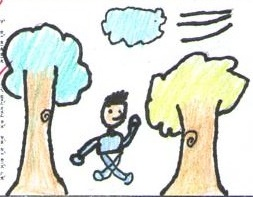

公園裡的大樹小樹們，要舉辦一個歡樂會。風呼呼呼的唱，大樹咻咻咻的伴著，小樹們沙沙沙的和著，小花小草們也搖擺著舞蹈。大家都快樂唱著歌、跳著舞，小朋友也想跟著一起加入這場歡樂會。

<洗鞋子> 王子瑞
===============

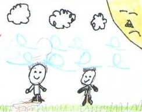

昨天我們去公園玩，「撲通」一聲我踩到了泥巴，老師帶我回去清洗，還告訴我洗有泥巴的地方。結果，我不小心把整雙鞋都洗子，老師只好誇獎我把鞋子洗得很乾淨。

<昨晚下的大雷雨> 李育德
=======================

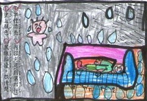

昨天半夜突然下起一場大雷雨，哄隆隆的聲音，吵醒了隔壁的小嬰兒哇哇大哭，也吵醒了正睡的香甜的我，還好有雨聲希哩嘩啦的節奏聲，我才又進入夢鄉。

<美麗的大自然> 沈育家
=====================

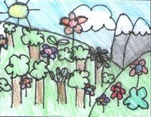

大樹像森林的裝飾品，製造美麗的大自然，一到早上，就可以看到高高的大樹釋放出新鮮的空氣，讓我們的家園更健康更美麗。希望人們不要再砍樹了，這樣才有美麗的世界。

<空氣清淨器> 馬玉安
===================

大樹就像一台空氣清淨器站立在土地上。每當太陽出來時，它就開始製造新鮮空氣，讓早起的人們都能夠舒舒服服的呼吸，為一天的開始作準備，讓人們充滿了活力。

<下課的操場> 蘇筱惠
===================

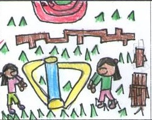

今天我和馬玉安去操場玩，風呼呼呼的吹，把樹葉吹得沙沙沙響。我們在操場吊單槓，可以看到很遠的地方，操場上的小朋友們都跑來跑去，玩得很開心。

<春天來了> 邱靖雯
=================

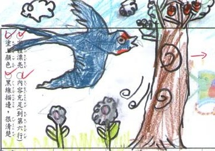

春天來了，山上的昆蟲出來了，小青蛙們呱呱呱的叫著，尋找好朋友，蟋蟀雞雞雞的忙工作，燕子們啾啾啾為蓋新家而忙碌，我啦啦啦的唱著春神來了，到處充滿迎接春天的聲音。

<兒童節> 賴祈臻
===============

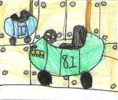

兒童節，爸爸媽媽帶我去兒童育樂中心。一進育樂中心，我看到許多好玩的器材，有船、有旋轉木馬，有咖啡杯。我最喜歡坐碰碰車，我和媽媽開的碰碰車圖案是毛毛蟲，碰碰車撞來撞去好恐怖。育樂中心真好玩，希望下次還可以再去玩！

<我最喜歡去的地方> 潘沐妍
=========================

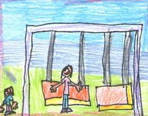

我最喜歡去基隆阿公家附近的公園，每到假日時，媽媽會帶我和妹妹去，那裡有盪秋千和溜滑梯。我會在那裡玩盪秋千，也會和妹妹一起玩跳繩，我們在那裡玩得很開心，所以我希望媽媽假日時能常帶我去阿公家。

<園遊會> 鍾定言
===============

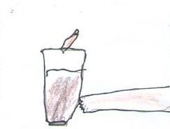

我最喜歡的園遊會終於來了。園遊會販賣的商品堆積如山，多如海水。最受歡迎的攤位就是「乾冰汽水」，那冰冰涼涼的乾冰，加上好喝的汽水，讓我忍不住想買一杯。而烤肉串的香味傳遍整個校園，吃起來讓人心滿意足。感謝爸媽陪伴我度過這次的園遊會，讓我留下深刻的印象。

<園遊會> 郭奕岑
===============

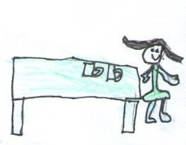

我期待的園遊會終於來了。園遊會的攤位都貼著五顏六色的海報真好看。最受歡迎的攤位就是姐姐班的「杯子推推樂」遊戲，攤位前隨時都是大排長龍，還有冰冰涼涼的水果冰淇淋，讓人想再多吃一枝。這次的園遊會，真是好玩又有趣。

<媽媽像什麼> 黃冠銘
===================

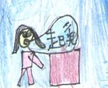

媽媽像什麼？媽媽像鬧鐘，每天早上叫我起床，不怕辛苦不嫌累，還不用電池。媽媽像字典，當我有不會的問題時，媽媽都會為我解答。媽媽像天使，每當我哭泣時，她都會安慰我。媽媽像魔術師，每天變換菜色，煮飯給我吃。媽媽像太陽給我溫暖，媽媽像月亮照亮我的家。媽媽，我愛您。

<我的媽媽> 紀威宇
=================

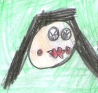

我的媽媽頭髮很長，有戴眼鏡，喜歡穿粉紅色的上衣，好像一隻可愛的小貓咪。媽媽都要幫我洗便當盒，幫我改作業，幫我買玩具，最辛苦的是上班賺錢養我，得承受老闆的壓力。我最愛的媽媽，希望您永遠在我身邊。

<跳舞> 蔡宜珊
=============

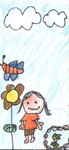

::
    
    誰會跳舞？
    蝴蝶會跳舞，
    跳著舞步，穿過花園，
    一起去玩耍。
    誰會跳舞？
    金魚會跳舞，
    跳著舞步，穿過池塘，
    一起找食物。
    誰會跳舞？
    姐姐會跳舞，
    跳著舞步，穿過客廳，
    蹦蹦跳跳的出門去。

<搬家> 瞿寧
============

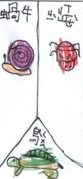

::
    
    誰會搬家？
    蝸牛會搬家，
    背著房子，越過高牆，
    一起去郊遊。
    誰會搬家？
    寄居蟹會搬家，
    背著房子，越過沙灘，
    一起換新家。
    誰會搬家？
    烏龜會搬家，
    背著房子，越過大海，
    悠閒自在的游泳。

