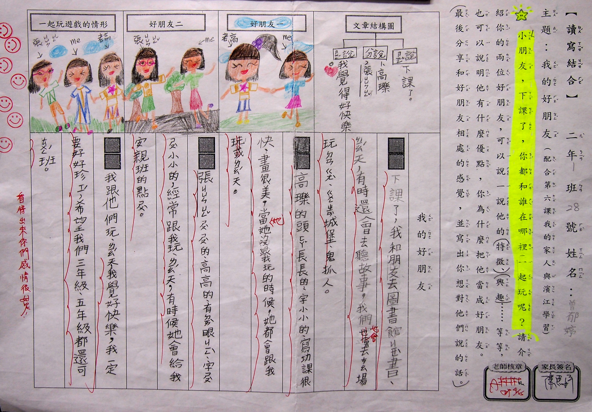

========
二年一班
========

童詩篇
======

.. figure:: 201/20109.jpg
    :align: center

    20109 林睿宇

.. figure:: 201/20111.jpg
    :align: center

    20111 李昱辰

    20112 郭彥均

.. figure:: 201/20113.jpg
    :align: center

    20113 柯王翔

    20126 鄭茗仁

.. figure:: 201/20131.jpg
    :align: center

    20131 林蔚嵐

短文篇
======

.. figure:: 201/20102.jpg
    :align: center

    20102 吳翔曜

.. figure:: 201/20129.jpg
    :align: center

    20129 郭遠馨

    20128 曾郁婷

    20105 張鈞傑

    20125 蔡佳妤

.. figure:: 201/20101.jpg
    :align: center

    20101 郭哲瑋

故事篇
======

<奇妙森林大冒險> 陳彥斌
-----------------------

這裡是臺灣的奇妙森林，裡面住著許多昆蟲，有蜻蜓、甲蟲和螞蟻，還有很多稀奇古怪的樹，有長手的、也有長腳的，非常特別吧！主角螳螂個性兇猛殘暴，牠的名字叫尼尼，牠出生在軟囊裡，最怕的東西就是毒蜘蛛。另外一個主角螽斯個性開朗活潑，牠的名字叫絲絲，出生在泥土裡，天敵是螳螂跟毒蜘蛛。

有一天，螳螂經過草叢時看見螽斯正在欺負螞蟻寶寶，螳螂想：「這個傢伙體型還蠻大的，可不能掉以輕心呀！」於是螳螂想了一個辦法，牠先把翅膀張開，把大螯舉在胸前，擺出可怕的樣子嚇得螽斯不敢動，再把鎌刀刺進螽斯的身體裡，最後螳螂就一口一口的吃掉螽斯，在旁邊偷看的小蜻蜓心想：真是可怕呀！於是牠回去告訴朋友，大家都一直責罵螳螂，有人說：「他怎麼可以吃掉我們的夥伴？」也有人說：「怎麼這麼沒良心，以後不要跟螳螂玩了！」這些消息傳到螳螂耳裡，牠不但不傷心，反而反駁說：「我管你說什麼，只要是活的昆蟲就通通要被我吃掉！於是，大家想了一個辦法－設了一個陷阱，等到螳螂踩到時就會掉下去，大家等了一天、兩天、三天還是沒等到，到了第四天，終於看到螳螂了，牠果然粗心大意沒看到地上的陷阱，一不小心踩到了，碰的一聲螳螂摔進陷阱裡，螳螂哀求著說：「喔！你們放了我吧！我以後不做壞事了！」大家想了想說：「好！放了你，但是你要說到做到。」螳螂說：「好！」大家放了螳螂後，奇妙森林的昆蟲從此以後過著幸福的生活。

    201110 陳彥斌

<快樂森林> 蔡沛恩
-----------------

這是快樂森林，裡面住著將近七萬隻動物。森林裡有一個香菇屋，裡面住著兩個主角。第一個主角叫做小利，是一隻刺蝟，他很怕狗，他的魔法是會把東西變不見，優點是很會找食物。第二個主角名字叫做小兔，她害怕獅子，只要她看到獅子，她就很快地跳走了，她的魔法就是把東西變成白色，優點是很會跳。

有一天，小利和小兔在散步時看到小雞被一隻獅子抓走了，他們兩個很想救他，可是他們很害怕，小利想了一個好方法，他把小雞變隱形，獅子發現小雞不見的時候，生氣的追著小利和小兔，小雞發現他們被獅子追的時候，就爬到獅子身上，然後用他的超能力把獅子踢倒。小利和小兔開心的說：「謝謝你。」小雞說：「我可以和你們做朋友嗎？」他們說：「好啊！」三個人就一起走回家。

隔天，小雞打電話邀請小利和小兔一起去彩虹樂園玩，小雞說：「我們一起去彩虹樂園玩，我會在半路上的巨人山上等你們。」他們說：「好啊！」沒想到等了好久好久，還是等不到他們，小雞以為發生了什麼事，正要去找他們的時候突然聽到一陣歌聲，原來是小兔在唱歌，小雞看到他們就問：「為什麼這麼晚來呢？」他們說：「因為我們太慢出發，對不起。」小雞說：「沒關係，我們趕快去彩虹樂園玩吧！」

到了彩虹樂園後，小雞開心的說：「我們先玩海盜船好嗎？」小利說：「不要，我們應該先玩雲霄飛車吧！」小雞和小利突然吵了起來，小兔說：「你們兩個不要吵了，如果你們一直吵，那不就沒有時間可以玩了嗎？」小利說：「對耶！我們一直吵也沒有用。」小兔說：「那我們不要吵了，先玩海盜船，再玩雲霄飛車好了。」

玩海盜船的時候，小雞覺得有點害怕，因為海盜船搖得越來越高，小雞跟小兔說：「小兔，我好害怕喔！」小兔說：「沒關係，再等一下下就好。」他們下了海盜船，準備要搭雲霄飛車的時候，突然聽到一個聲音，小兔仔細的看，竟然看到一個大巨人，小兔大叫一聲接著說：「快逃啊！」他們趕快跑出遊樂園，小利問：「為什麼剛剛妳要大叫？」小兔說：「因為我剛剛看到一個大巨人。你看！他追來了，小雞趕快用你的超能力把巨人踢倒吧！」小雞說：「看我的！」「ㄅㄥˋ~~~~~！」大巨人被踢倒了。小利說：「雖然你很小，但是你的超能力很有用。」小雞說：「謝謝你，我要邀請你們明天來我家喝下午茶，我會準備蟲、紅蘿蔔和麵包。」小兔說：「真是謝謝你，還準備了我喜歡吃的東西呢！Bye bye明天見！」小雞說：「再見，記得要來我家喝下午茶喔！」

隔天一大早小雞就到院子裡找蟲，突然有一隻老鷹從小雞家飛過，小雞心想：還好我沒被老鷹抓走，蟲應該夠了吧！我趕快去煮紅蘿蔔。快煮好的時候，門鈴響了，門都還沒開就聽到小兔說：「我們要來你家喝下午茶了！」小雞急忙打開門說：「我一大早就起來準備下午茶耶！趕快進來吧！」小兔肚子很餓，一進去就馬上坐上椅子吃了起來，小利跟小雞說：「下次換我們請你到巨人山野餐，好嗎？」小雞開心的說：「好啊！不知道你們會準備什麼呢？」小雞說：「這是驚喜，等野餐的時候，你知道了！」享用完下午茶後，他們開心地互道再見。到底小利跟小兔要給小雞什麼驚喜呢？你可以猜猜看喔！

    20127 蔡沛恩

<美麗的錯誤> 蕭祈
-----------------

美麗的小醜比頭國隱藏在瀑布後面，住著各式各樣的小醜比頭精靈，一開始這個瀑布沒有醜比頭，這些醜比頭為什麼要來這裡，又是另一個故事了。而故事的開始就從粉屁桃發現了一個陷阱開始……

「大新聞！大新聞！」粉屁桃大叫著，全部的醜比頭聽到後都到瀑布集合點集合，粉屁桃說：「大家看瀑布外面有一根木頭，上面有一顆看起來好好吃的水蜜桃……」說到一半，粉屁桃竟然被吸引住了，大家馬上抓住粉屁桃，粉屁桃才停下腳步，繼續說：「對不起，因為看起來香嫩多汁，好好吃的樣子，我有一個朋友就是這樣被人類抓走的！」大家聽了都很害怕，粉屁桃壓低聲音說：「人類抓我們的工具越來越厲害了，越來越多醜比頭被抓走了，我們要去救他們，但是不能被人類發現。」於是粉屁桃廣播宣布：「全國的醜比頭注意！我們要一起去人類家就醜比頭！」有的醜比頭拿人類的地圖，有的拿火把，他們決定一起去救朋友。

出發之後，路上竟然被巨蛇擋住了，大家都很緊張，突然奶奶頭想到一個好方法：「我的頭上可以擠出牛奶，我可以用牛奶噴巨蛇的眼睛，小花頭是肉食性的，可以咬住巨蛇，粉屁桃可以用水蜜桃丟巨蛇！」說完大家開始攻擊，沒多久就把巨蛇打死了。

他們繼續走，終於走到人類的家，但是怎麼找都找不到被人類抓走的醜比頭，毛毛球說：「我知道為什麼我們會找不到，因為人類的家很大，我們找的範圍要更大！」沒想到話才剛說完，赤羽佛看到一扇門，上面寫著「醜比頭收藏地」，紅蘑菇說「醜比頭們一定是在這裡！」他們馬上動手打開門，但是門被鎖住了，還發出「逼逼逼逼逼」的聲音，大家都嚇了一跳，赤羽佛說：「人類果然很奸詐，我本來就不喜歡人類，現在我更不喜歡了！」宅忍精和宅忍姬說：「可是人類也有好人呀！有一次我們快要掉到懸崖下，就是人類救了我們，不過，現在應該不用討論這個，我們的大麻煩是如何打開這個門吧！」就在大家正在思考的時候，突然有個人類走了過來，大家非常慌亂，「來不及了！要被人類抓走了，大家快跑呀！」奶奶頭說。「哇！是一大群醜比頭耶！媽媽！快來看，不然醜比頭就要跑走了！」說話的是一位小女孩，她是「醜比頭收藏地」的小主人，「等等！醜比頭們，別跑呀！我沒有要傷害你們！」屁桃一聽又想到宅忍精和宅忍姬說的話，便立刻叫大家停下腳步，他回頭走到小女孩的前面，用最大的力氣大聲說：「妳說妳沒有要傷害我們，那請妳把『醜比頭收藏地』裡的鑰匙給我們，我們想要救回我們的朋友們，拜託拜託！」小女孩說：「哈哈哈！我根本就連一隻醜比頭都沒有呀！你們太厲害了，我都抓不到，而且我是很喜歡醜比頭，想邀請你們到我家玩而已，不信的話，你們看！」小女孩打開門，裡面準備了各種醜比頭喜歡的東西，但是連一隻醜比頭都沒有。屁桃對小女孩說：「對不起！對不起！」小女孩說：「沒關係！一定是別人抓的啦！我很希望有機會可以邀請你們到這裡當客人喔！」屁桃說：「好呀！只是我們現在得繼續去找人類的家，我們一定要救出我們的朋友！」

他們跟小女孩互道再見，又繼續出發了，屁桃說：「奇怪！為什麼『人類的家地圖』會出錯呢？是誰變出來的？」小花頭連忙跑出來說：「屁桃，對不起，是我啦！我也不知道為什麼會這樣……」屁桃說：「沒關係啦！我們因此認識一個喜歡醜比頭又不會把我們抓走的人類，也算是『美麗的錯誤』吧！

    20121 蕭祈
