========
二年二班
========

李安婷
======

今天是校外教學，我們到美堤碼頭坐船，我們坐的是飛魚6號，我看到好多魚跳起來，好像在歡迎我們呢！我還看到大白鷺鷥和小白鷺鷥，牠們飛的模樣比天鵝還要美麗，最後我們站在船的前面，一邊吹著微風，一邊看河景，真是浪漫極了！就這樣開心地度過坐船之旅！

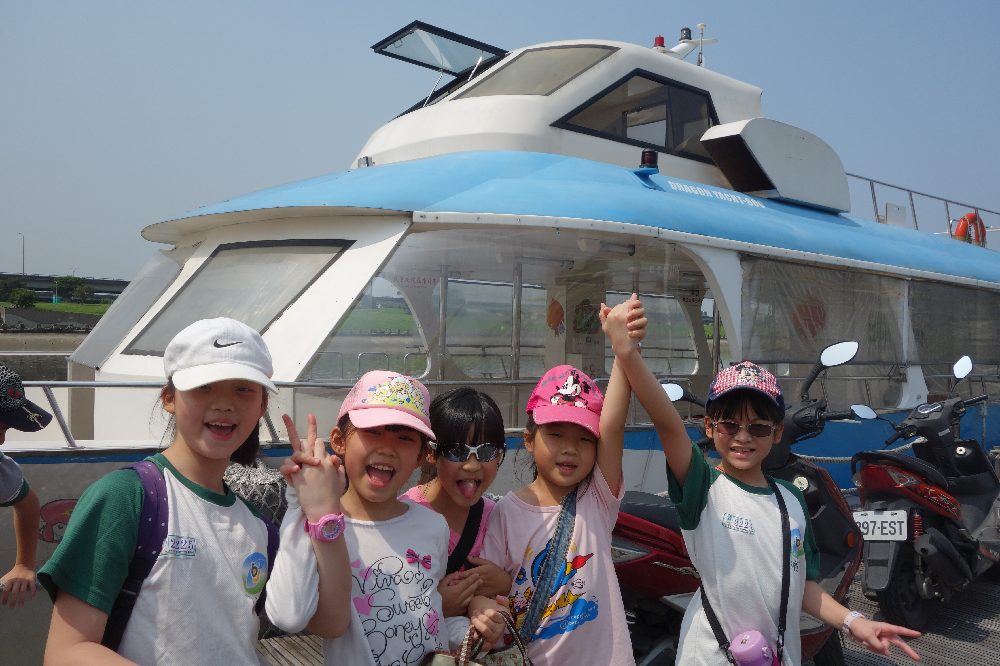

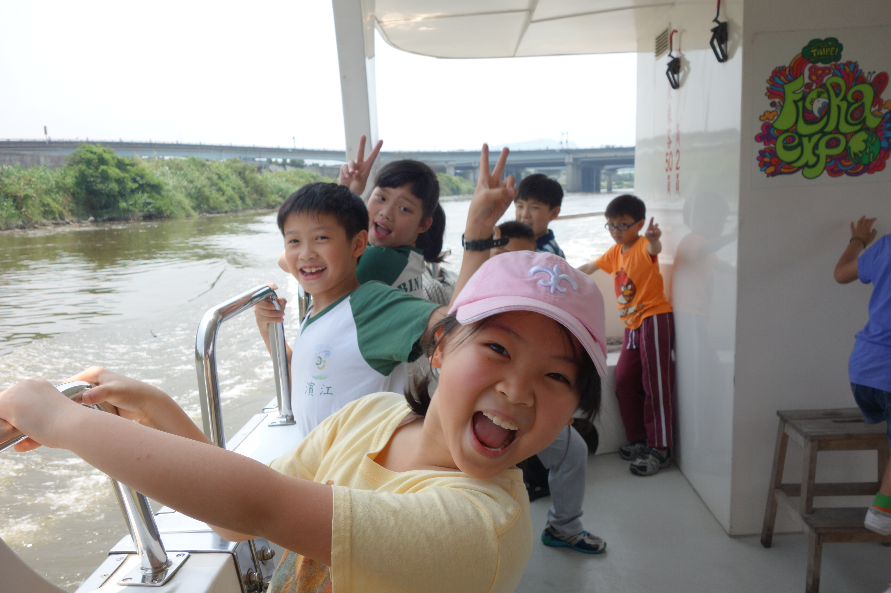

鄧喬予
======

今天老師帶我們去美堤遊河，浪很大，而且老師還叫我們到船頭去欣賞風景，好恐怖喔！因為船身好晃，很容易跌倒，要握好扶手才行。沿路上，我看到飛魚、大白鷺、小白鷺、黃頭鷺和蒼鷺，飛魚一直跳起來，好酷！白鷺鷥也飛起來，飛得好高！在船上，李老師介紹很多關於基隆河的知識，譬如：基隆河截彎取直的事；美堤河濱公園的由來……等，讓我又吸收到了很多新的知識。我們下船之後，老師問我們：「好不好玩？」我們說：「好玩！」我覺得這次的校外教學很特別，希望下次也可以像這次一樣特別。

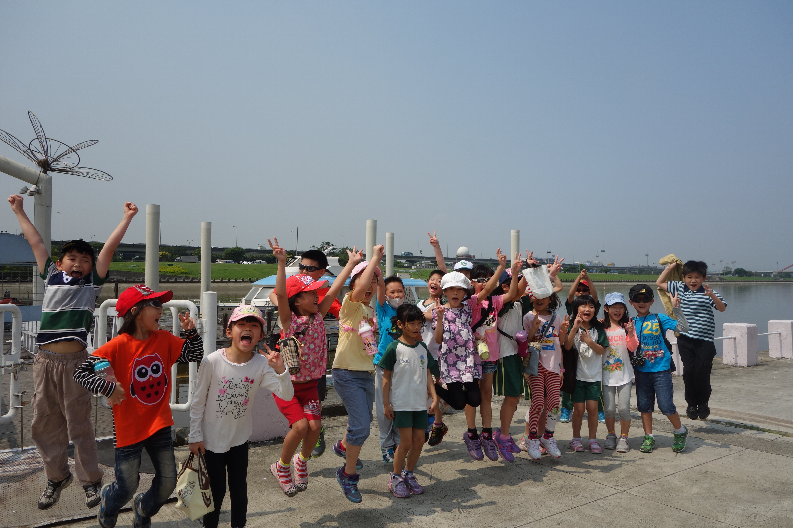

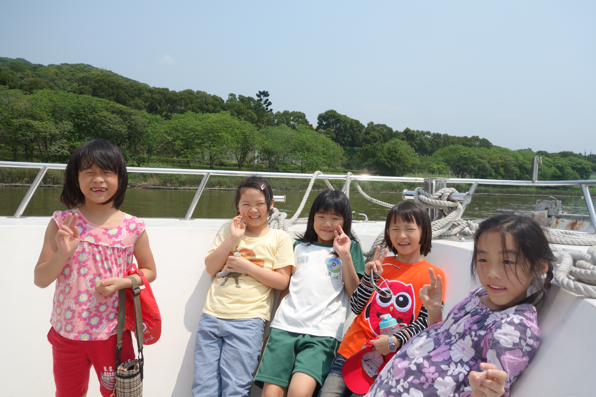

劉晏銘
======

今天老師帶我們去美堤河濱公園搭船，導覽有介紹：小白鷺、大白鷺、黃頭鷺和夜鷺，而且我還看到一隻有一公尺長的白鷺鷥呢！這幾隻鳥的顏色非常鮮豔，讓人驚訝連連，我們也有去甲板上看河上的風景，河上風景真好看！我也有看到許多魚在河上跳來跳去，真可愛！以前我都不知道藍色公路是那麼好玩的一條河！ 希望媽媽以後可以跟我一起再來搭船。

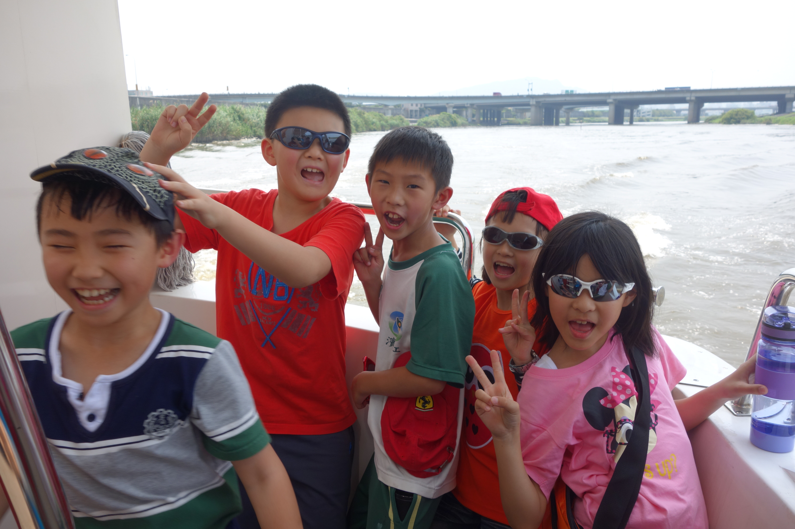

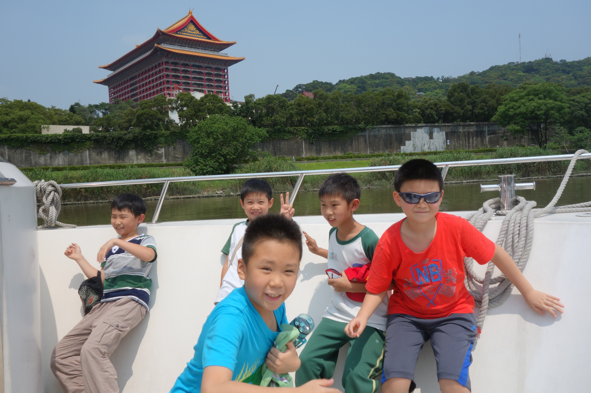

李啟嘉
======

::
    
    媽媽像警察，
    每當我做錯事，
    她都馬上提醒我。
    媽媽像廚師，
    每天煮出香噴噴的山珍海味，
    也會煮出香甜可口的點心。
    媽媽像車子，
    帶我跑遍全世界，
    想去哪裡就去哪裡，
    媽媽呀！媽媽，
    我永遠愛您！

鄭羽軒
======

::
    
    媽媽像理髮師，
    每天幫我梳頭髮，
    每天幫我綁頭髮。
    媽媽像清潔隊員，每天打掃家裡，
    每天管我書桌有沒有乾淨。
    媽媽像老師，
    每天教我功課，
    每天幫我溫習功課。
    媽媽呀！媽媽，
    您的恩惠我一定會報答的。

黃芃睿
======

::
    
    媽媽像廚師，
    當我肚子餓的時候，
    她都會煮好吃的飯菜給我吃。
    媽媽像百科全書，
    教我許多有趣的知識和遊戲，
    讓我學會更多知識。
    媽媽像蝴蝶，
    每天穿著票漂亮亮的衣服去上班，
    還會抹上香噴噴的香水很迷人。
    媽媽呀！媽媽，
    我永遠愛您！

盧沛潔
======

::
    
    媽媽像加油站，
    我比賽輸了，
    她都會鼓勵我。
    媽媽像廚師，
    天天煮飯給我吃，
    都不怕累。
    媽媽像英文字典，
    我不會的英文功課，
    她都會教我。
    媽媽呀！媽媽，
    您真萬能，我愛您！。

夏于涵
======

::
    
    媽媽像魔術師，
    我想要什麼東西，
    她都會馬上變出來給我。
    媽媽像溫度計，
    當我發燒的時候，
    用她溫暖的手輕輕的抱起我。
    媽媽像月亮，
    每當晚上的時候，
    她會在床邊靜靜地守護著我。
    媽媽呀！媽媽，
    我永遠永遠愛您！

蔡兆恒
======

::
    
    媽媽像魔術師，
    每天都會變出可口的食物，
    還變出好多玩具給我玩。
    媽媽像孫悟空，
    不管是什麼事情她都會做，
    再難的事情都難不倒聰明的媽媽。
    媽媽像大富翁，
    不管是什麼東西，
    都一定買得起。
    媽媽呀！媽媽，
    我真的很愛您！

詹凡萲
======

校外教學出發前，我很興奮，也很期待，我還帶了筆記本，想記錄今天看到的事物。我在背包裡帶了幾顆阿公送我的雷神巧克力，在車上我們還看冰雪奇緣。

我們先做糕餅，我做了六個，我覺得我做的糕餅比我想像中的好多了，製作糕餅時，我把搓好的小麵糰放進模型，我敲了好多下，企鵝模型裡的麵糰才掉出來。我們享用了茶點，有烏龍茶、餅乾、果凍和喜餅，讓我印象最深刻的是果凍，它冰冰的，很像冰淇淋，還有人把它加到烏龍茶裡，他們說這樣更好喝。

遊戲玩完後，我們去參觀博物館，導覽姐姐介紹了什麼儀式該用什麼糕餅，比如收涎，小BABY 四個月會一直流口水，所以大人們會用紅色的線串成圓圈，上面掛餅乾。

今天的郭元益糕餅館半日遊真好玩，讓我印象最深刻的是林倢宏在臺上高歌一曲，讓大家笑得合不攏嘴。

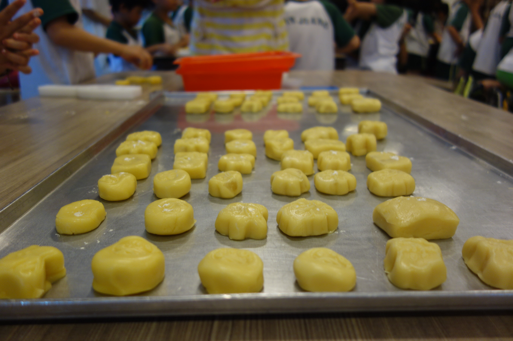

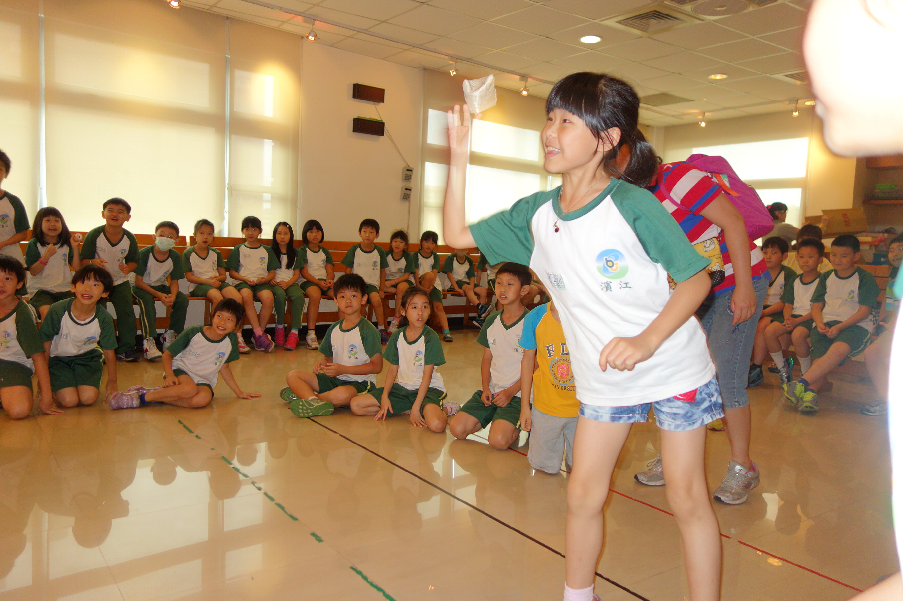

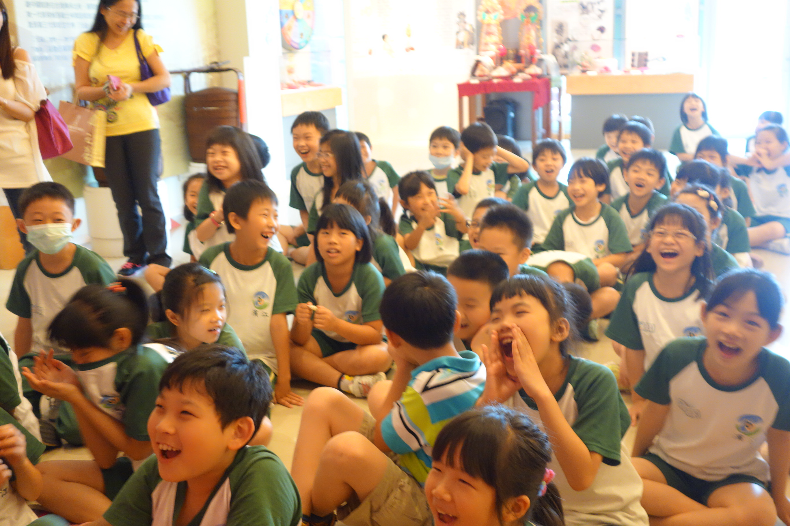

陳昀昀
======

今天到學校時，我好興奮喔！因為我想快點學會荔枝酥怎麼做，我也想看博物館長什麼樣子？出發前，老師還跟我們說要很乖，因為想要到郭元益博物館的學校都要等兩年以上，但我們沒有等很久的原因是因為他們聽說我們很乖才讓我們去的。

到了遊覽車上，電視上播放著冰雪奇緣的影片，但因為郭元益博物館很快就到了，所以連一半都沒看到。到了糕餅博物館，有一個阿姨教我們做荔枝酥，在烤荔枝酥時，另外一個阿姨帶我們去玩九宮格，贏的那一組有禮物，輸的那一組要表演才藝。接下來，她帶我們到五樓參觀博物館。阿姨站在一個紅色的檯子上，把紅色的繡球拋出去，李啟嘉把它接住了，阿姨請他上臺，然後她大聲的說：「他是我老公！」後，就讓李啟嘉回去了，接下來，他丟出了繡球，這一次，張佳芯接住了，阿姨請他上臺，然後幫她蓋上一塊紅布，然後請她把繡球丟出去，張佳芯就把繡球丟出去，李育誠把它接住了，阿姨請李育誠上臺，然後幫他戴上一頂帽子，那頂帽子上還有一根辮子呢！

最後，我們回到樓下去拿荔枝酥，超香的！我覺得郭元益博物館好好玩喔！除了可以做荔枝酥，還可以玩很多遊戲，真希望每次校外教學都可以去郭元益博物館。

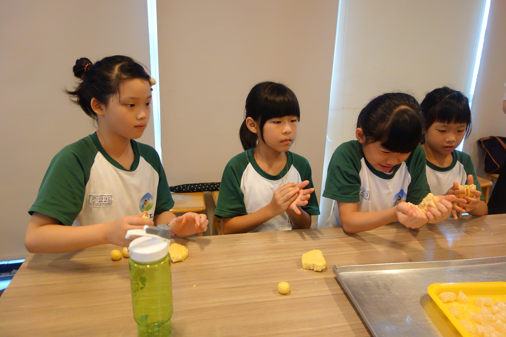

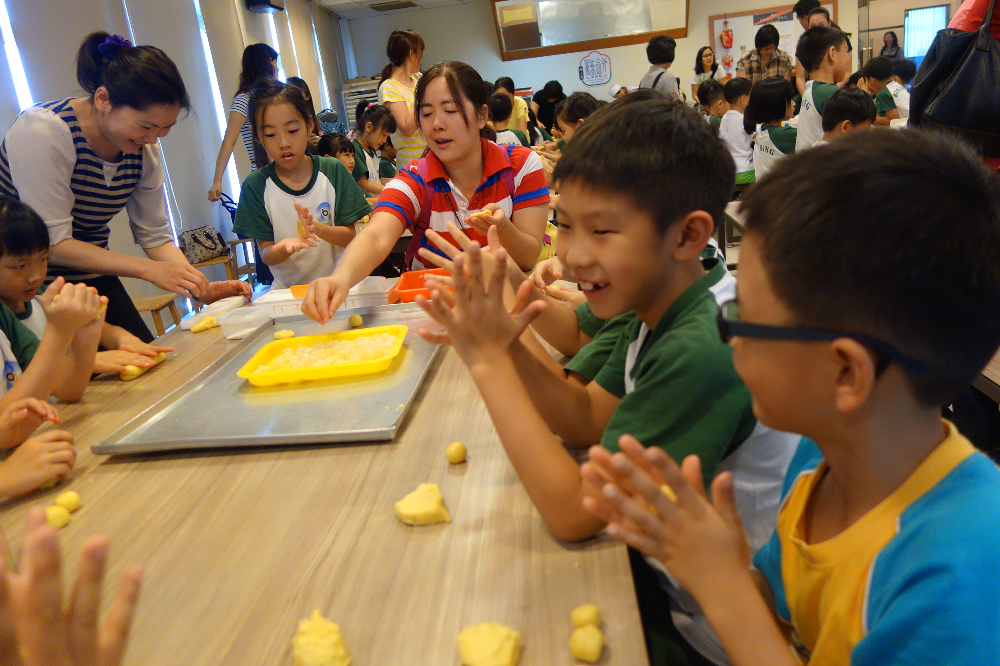

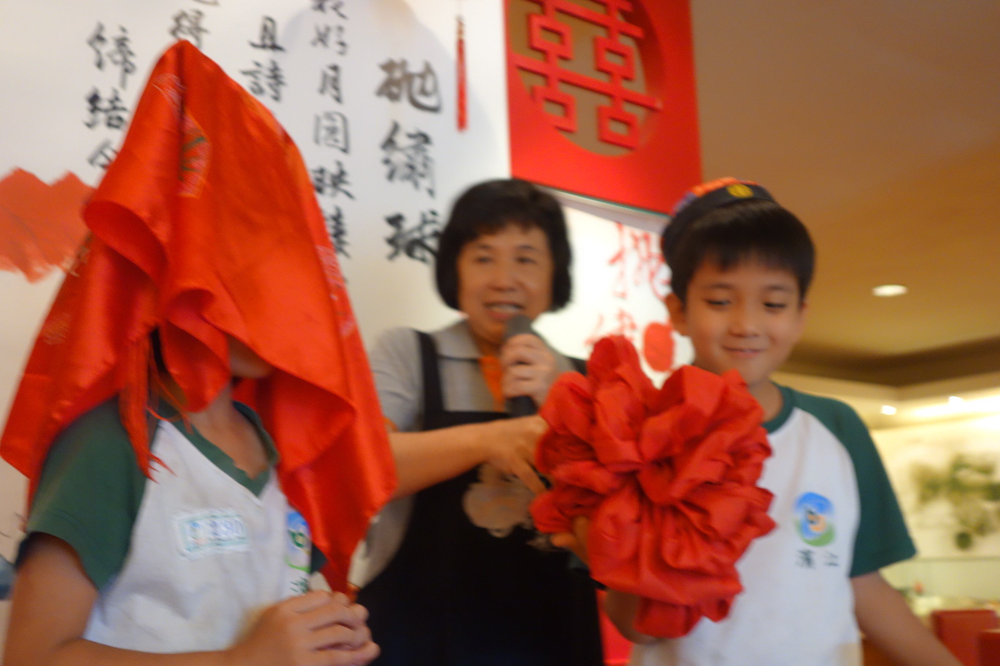
