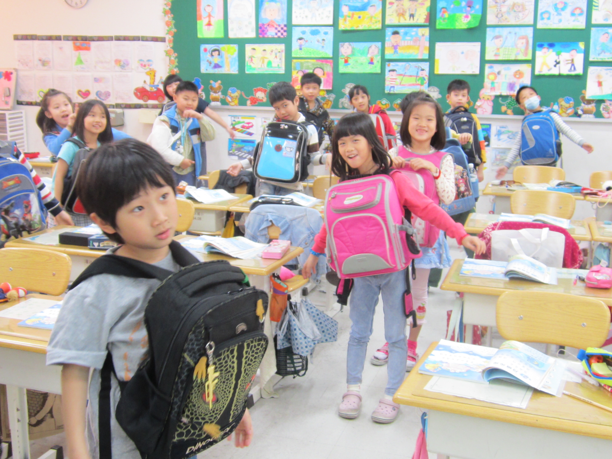

=========
二年三班
=========

校外教學 - 郭元益糕餅博物館
============================

懷著期待的心情，我們在端午假期的隔天出發前往郭元益糕餅博物館。這是一個陰涼舒爽的好天氣，一到那邊大夥兒立刻進行荔枝酥的糕餅製作，經過包餡與壓模的步驟，一個個小巧可愛的玉兔、老虎、大象、小熊荔枝酥紛紛出現。接著博物館還招待了好吃的糕餅甜點與好喝的熱茶，讓我們彷彿貴婦享受下午茶般的細細品嘗美味點心。等待的時間我們從導覽活動中認識嬰幼兒抓週的活動，以及古代嫁娶拋繡球的習俗。此外，還進行了刺激有趣的九宮格遊戲，大家玩得不亦樂乎！結束了導覽與遊戲活動，回到糕餅製作區，一盤盤金黃的荔枝酥已經出爐，大家興奮地把香氣四溢的荔枝酥裝到保鮮盒裡，心滿意足的離開這個好吃又好玩的好地方！

<藍色公路之旅> 丘秉叡
======================

今天早上，我們全班一起去搭船。上船的路上，我看到了麻雀、蝴蝶和蜘蛛等小動物。

上了船後，有一位李叔叔介紹各種白鷺鷥的名字和長相。不久，我真的看到兩隻白鷺鷥，一隻叫黃頭鷺，另一隻的名字我不知道。除此之外，我看到了海面上有死掉的吳郭魚，還看到有個只穿內褲的人在岸邊跑步，真是奇怪又有趣。經過這次的體驗，我真想再坐一次船！

<藍色公路之旅> 楊采睿
======================

今天是星期五，老師帶我們去搭船。

搭船時，我聽到李叔叔介紹烏仔魚、彈塗魚、白鷺鷥、蒼鷺、大白鷺、小白鷺、黃頭鷺和夜鷺。也實際看到好幾種魚和鷺出現在海上。

雖然沒有每一種介紹的動物都看到，可是我非常喜歡這次的藍色公路之旅！

<懷孕體驗> 李彥劭
==================

今天老師讓我們體驗當孕婦。一開始老師讓我們把書包清空，接著給我們一人一個氣球，塞進書包裡，然後要一整天把書包包在前面，並且不能把氣球弄破。當孕婦的時候，我發現有三個地方不方便，第一個是撿東西很麻煩，第二個是洗手的時候手要伸很長，第三個是寫字的時候也很不方便。我覺得當孕婦很不容易，我終於感受到當孕婦的辛苦。

<懷孕體驗> 呂婉韶
==================

今天在學校，老師叫我們把書包清空，然後把氣球塞進書包裡當作「寶寶」。我覺得這樣做事好不方便，像是撿東西、從抽屜拿書和睡覺都變得好困難，而且腰好痠啊！老師說：「這樣才可以真正體驗到懷孕有多麼辛苦呀！」

<懷孕體驗> 林冠廷
==================

星期二早上，老師叫我們把書包裡的所有東西拿出來，不知道要做什麼？原來，是要讓我們體驗懷孕。體驗懷孕的時候，像是撿東西、吃飯、刷牙漱口和寫字都很不方便。今天體驗懷孕的過程很辛苦，回去我應該感謝媽媽辛苦懷孕把我生下。

<母親節園遊會> 趙昕恬
======================

5 月 3 日星期六，是學校的園遊會。我和弟弟去玩推水杯。推水杯是這樣玩的：有三次機會，只要把它推到規定的線裡就獲勝。雖然我才成功一次，可是我抽獎的時候，抽中了特獎，所以我選了藍色小豬。希望我三年級的時候，可以開一個玩推水杯的攤位，讓大家玩得很開心！

<母親節園遊會> 劉志翎
======================

今天因為慶祝母親節，所以學校舉辦園遊會，以及辦了濱江文學賞的活動。我吃了盆栽冰淇淋和香菇茶葉蛋，但是我覺得最有特色的是哥哥班上的攤位，他們有手工製作的奶酪和果凍，上面撒了像是土壤的巧克力，還放上了清涼的薄荷葉，最後放到了盆栽裡，這樣就像真正的盆栽一樣，栩栩如生！我期待著下一次的園遊會，因為升上三年級我就可以賣東西，希望明年我們的攤位會賺很多錢！

<媽媽像什麼> 范家齊
====================

::
    
    媽媽像機器人，
    再多的工作，
    她都會做完再回去。

    媽媽像睡美人，
    每次放假的時候，
    不管是早上、中午還是晚上，
    她都在睡覺。

    媽媽像明星，
    每次出門的時候，
    她都打扮得漂漂亮亮。

    媽媽呀！媽媽，
    祝您母親節快樂！

<媽媽像什麼> 呂睿紘
====================

::
    
    媽媽像氣球，
    當她生氣的時候，
    「啪」！就會爆炸！

    媽媽像蜜蜂，
    媽媽很勤勞做事，
    把家裡打掃得很乾淨。

    媽媽像棒棒糖，
    媽媽的笑容，
    就像糖果一樣甜。

    媽媽呀！媽媽，
    祝您健健康康！

<媽媽像什麼> 王品絜
====================

::
    
    媽媽像導遊，
    暑假的每一天，
    媽媽都帶我去不同地方。

    媽媽像廚師，
    每天我肚子餓的時候，
    媽媽就會煮出各式各樣的晚餐。

    媽媽像音樂家，
    我考媽媽彈鋼琴，
    媽媽每一首歌都會彈。

    媽媽呀！媽媽，
    謝謝您每天照顧我！

<親愛的毛巾先生> 王天一
========================

::
    
    親愛的毛巾先生，
    請告訴我，
    為什麼你長的方方正正呢？

    親愛的毛巾先生，
    請告訴我，
    為什麼你可以把人的臉擦得像明星一樣閃亮呢？

    親愛的毛巾先生，
    請告訴我，
    為什麼你方方正正的身體可以吸水呢？

    親愛的毛巾先生，
    請告訴我，
    為什麼你可以把髒東西擦掉呢？

    親愛的毛巾先生，
    我想告訴你，
    你好像魔術師，可以消除髒亂真是厲害！

 
<親愛的黑板> 許允姮
======================

::
    
    親愛的黑板，
    請告訴我，
    為什麼你綠綠的身體這麼大？

    親愛的黑板，
    請告訴我，
    為什麼你能讓老師在你身上寫字？

    親愛的黑板，
    請告訴我，
    為什麼你可以讓磁鐵吸在你身上？

    親愛的黑板，
    請告訴我，
    為什麼老師寫字這麼大力，你都不會痛？

    親愛的黑板，
    我想告訴你，
    你好厲害，我長大後也要利用你來教小朋友喔！

 

<親愛的夏天> 黃再年
====================

::
    
    親愛的夏天，
    請告訴我，
    為什麼你在的時候，白天這麼長？

    親愛的夏天，
    請告訴我，
    為什麼你會讓人們把一件件厚衣服脫掉？

    親愛的夏天，
    請告訴我，
    為什麼你總是讓大家好想吃冰淇淋？

    親愛的黑板，
    請告訴我，
    為什麼你能讓冰溶化？

    親愛的黑板，
    我想告訴你，
    真希望我一年四季都能看到你！

〈生活課作品〉動物陶土
=======================

