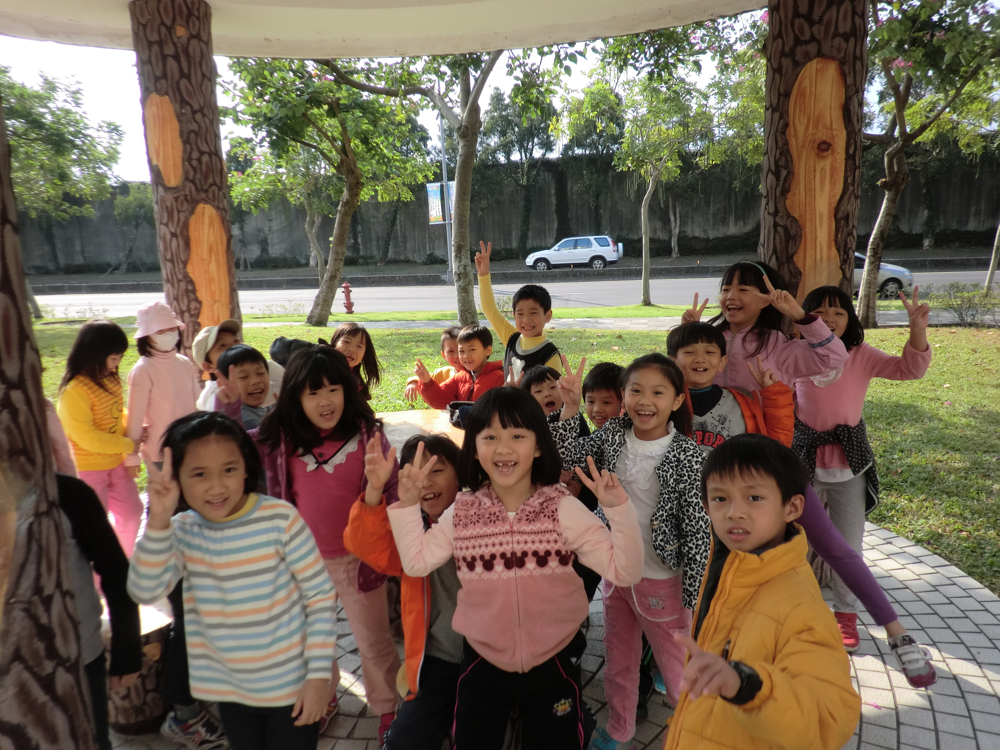
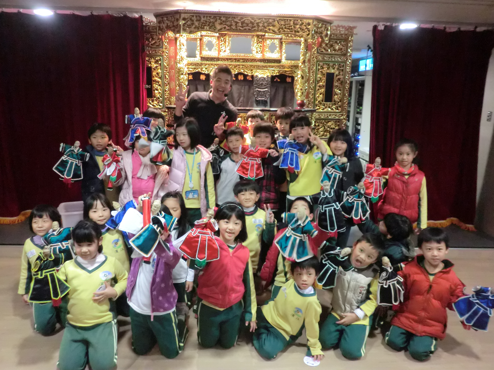
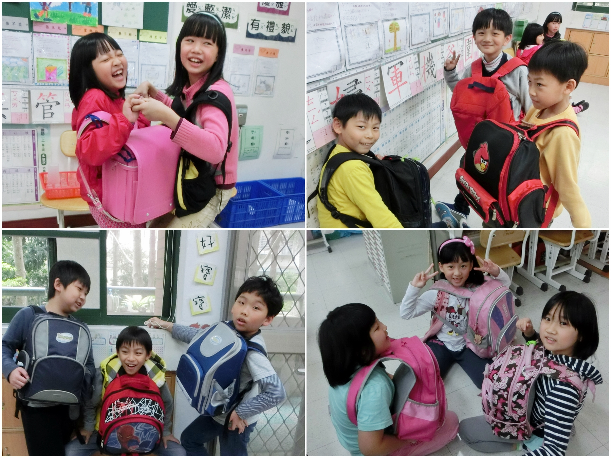
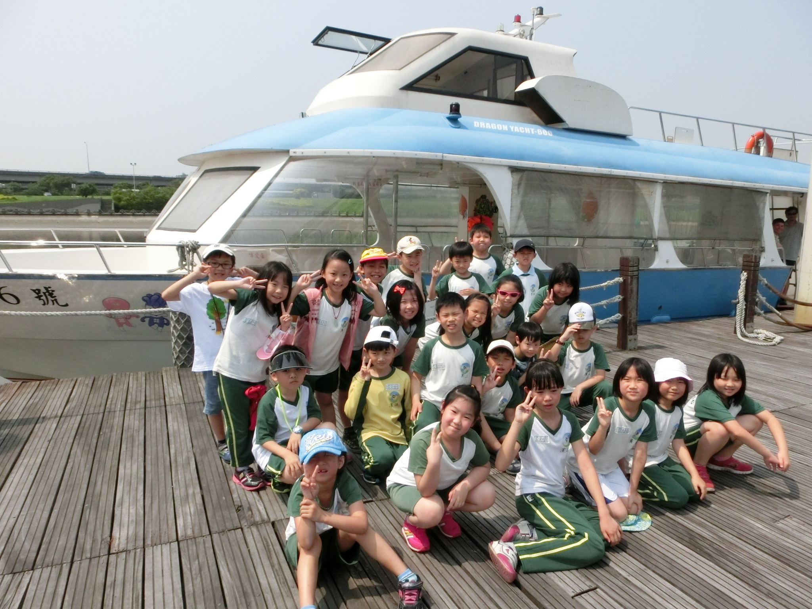
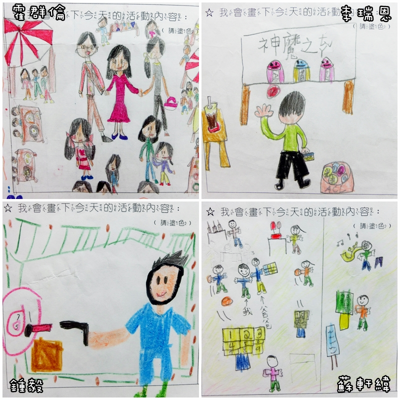

========
二年四班
========

<社區散步真有趣> 邱芷妍
=======================
今天我們全班一起去逛社區，我們先到社區的涼亭坐一下，結果有同學在地上發現了一大群椿象，有一個人還不小心踩到牠們。還有人發現會飛的樹葉，老師說，那片樹葉是因為被蜘蛛網黏住的關係，才會飛在半空中。

下一站是土地公廟，老師告訴我們，摸了廟門旁邊那兩隻獅子嘴巴裡面的石頭，就會很幸運呵！我們全班都摸了，只有一個小朋友沒有摸，因為她信仰不同的宗教，所以她不行摸。真希望摸了石獅子嘴裡的石頭，我們的願望都能實現。

<社區散步真有趣> 吳倞
=====================
星期四老師帶我們班去社區散步。一開始我們先經過涼亭，休息時我看到一大群椿象在地上爬來爬去，我覺得好噁心呵！但是，有的同學卻覺得牠們好可愛呢！

然後我們經過土地公廟的門前，主兒竟然哭了！老師趕緊安慰她說︰「主兒不要哭了！土地公廟只是一個拜拜的地方而已，不會恐怖的！」接著，我們繼續往前走，發現了一些遊樂設施。老師說︰「現在休息十分鐘，大家可以去玩自己想要玩的遊樂器材呵！」時間到了，我們正準備要離開的時候，主兒媽媽叫住了我們，還發餅乾給大家吃。但是有人貪心偷拿很多，老師就生氣了，還要他們把餅乾放回去。

之後，我們經過了很多同學的家，老師發現天空開始變得陰陰的，就趕緊帶我們回學校了，我們完成了一次有趣的社區之旅！

<快樂的校外教學> 龔子穎
=======================
今天很冷又下雨，但是我超級高興，因為可以和媽媽及同學一起出去玩。我們搭乘遊覽車，一下子就到了，原來大稻埕戲苑是在迪化街的永樂市場樓上。

有一位叔叔很仔細的為我們介紹布袋戲、魁儡戲和皮影戲。原來戲裡面有「生、旦、淨、末、丑、雜」六種角色，而唐明皇和田都元帥是戲神。我很喜歡看傳統布袋戲，因為彩樓舞台很漂亮，戲偶很美，而且他們的動作和說話既優雅又有趣。我的阿公和爸爸是霹靂粉絲（電視版的大型偶，一百公分的那種），我很喜歡今天的活動。中國的戲劇真是一門特別的大學問！

<大稻埕戲苑的校外教學> 許祐誠
=============================
我們今天去校外教學，去的地方是大稻埕戲苑。一開始要坐電梯上樓，電梯一到，老師和全班二十三個小朋友要搭同一台電梯，我覺得很誇張，結果沒想到電梯還真的能塞下全班同學和老師呢！

後來工作人員為我們介紹布袋戲，我看到孫悟空、豬八戒，還看到傀儡戲呢！接著還介紹皮影戲和課本上提到的水上木偶戲，水上木偶戲的木偶好大，有四十多公分高呢！最後我們還看布袋戲的表演，我覺得最好笑的就是壞蛋去撞柱子的時候。雖然今天的天氣很冷，我還是覺得很好玩。

<開心的校外教學> 張哲寧
=======================
期待已久的校外教學，終於到了，這次我們去的地方是大稻埕戲苑。我們看到各種戲偶，他們都有自己的名字，例如，關公的行當是「淨」，張飛的行當也是「淨」。我們還有看布袋戲表演，表演的台子名字叫做「彩樓」。之後我們還操作皮影戲偶，它是用動物的皮做的，我覺得很奇怪，如果皮影戲偶是用牛、羊和驢子的皮做的，應該會有毛在上面吧？要不然也應該有一些顏色，怎麼都是土黃色的呢？而且，牛、羊和驢子的皮都是軟的，怎麼戲偶摸起來是硬硬的呢？ 

<懷孕體驗> 黃翊禎
=================
今天，我們全班都要參加「懷孕媽媽大考驗」，我原本以為很輕鬆，但是，才背著書包上兩節課，就已經覺得腰酸背痛了！吃飯的時候，我跟午餐好像有十萬八千公里的距離，還有還有，上廁所時我覺得很容易就會噴到書包，所以，當媽媽真的很辛苦呢！

<懷孕體驗> 廖迎安
=================
因為母親節快到了，所以我們班舉辦一個活動叫做「懷孕體驗」。我們一聽到這個活動都很興奮，老師說要先把書包裡不需要的東西拿出來，再把氣球裝進去，然後要背一整天，而且不能讓氣球破掉。所以，我就很小心地做每一件事。

我發現上廁所的時候很難上，還要把書包移到一邊，不然會尿到書包上；還有穿鞋子的時候很麻煩，因為看不到腳或鞋子在哪裡，所以很容易穿錯腳。上課上到一半的時候，突然聽到「砰！」的一聲，全班都嚇了一跳，原來是祐誠書包裡的氣球寶寶破掉了，因為他一直在玩書包上的拉鍊，所以氣球破掉了。到中午要去洗手準備吃飯的時候，我的書包差一點兒就要掉進濕濕的洗手台了，好險我有發現，趕緊把書包拿起來。還有要睡午覺的時候，一定要側睡，不然會把書包裡的氣球寶寶壓破，但是我不習慣側睡，我的頭一直壓在手臂上，害我一覺起來手都麻麻的。

上完生活課之後，我們終於可以把氣球寶寶「生」下來，老師要我們幫氣球寶寶畫上表情，群倫用很細的簽字筆畫，結果「砰！」的一聲，她的氣球也破掉了。接下來老師要大家分享今天活動的感想，我回答了很多問題，沒想到就在這時，又出現「砰！」的一聲，念芯的氣球也破掉了。今天真是刺激又有趣的一天呀！

<美堤碼頭搭船趣> 陳柔安
=======================
今天，老師帶我們到美堤碼頭搭船，在坐船時，我看到一些死魚浮在水面上，也有活魚跳出水面；我聽到流水的聲音和小魚跳上水面的聲音；我聞到河水的香味和同學流汗的臭味。我感覺基隆河好髒，有好多好多垃圾，像是寶特瓶、玻璃瓶、瓶蓋、塑膠袋……漂浮在河面上。我想，我們一定要好好愛護基隆河，不管是遊客還是附近社區的居民，都不能把垃圾丟到河裡。

<美堤碼頭搭船趣> 霍群倫
=======================
今天，老師帶我們到美堤碼頭搭船，在坐船時，我看到基隆河裡的魚一直跳出來，好像在跟我們打招呼；我聽到船上的引擎發出喀拉喀拉的聲音；我聞到臭臭的水溝味，讓我好想吐。我感覺今天坐船真有趣，讓我好開心。我想，基隆河的河水很髒，請大家不要再亂丟垃圾了！

<美堤碼頭搭船趣> 郭騏勝
=======================
今天，老師帶我們到美堤碼頭搭船，在坐船時，我看到河岸邊美麗的風景；我聽到叔叔們仔細的為我們介紹沿途的生態環境；我聞到河水中的魚腥味。我感覺自己學到了許多知識，也認識了各種白鷺鷥的品種與特徵。我想，今天的活動讓我大開眼界，也謝謝叔叔們為我們服務。

<美堤碼頭搭船趣> 周子遊
=======================
今天，老師帶我們到美堤碼頭搭船，在坐船時，我看到很多不同的白鷺鷥和魚；我聽到波浪聲和小鳥的叫聲；我聞到魚腥味和臭臭的垃圾味。我感覺涼爽又舒服，這是我坐過最穩的船。我想，如果河裡的水乾淨一點，我就會覺得更舒服更好玩了！

<熱鬧有趣的園遊會> 霍群倫
=========================
今天我和爸爸媽媽一起去參加學校的園遊會。一開始我不知道要做什麼事情才好，一圈又一圈地逛了又逛，然後肚子開始有點餓了，我就吃了一個布丁，之後我的胃口就全開了！

接著我記了通關密語，得到了免費的爆米花，我還去吃我最愛的冰淇淋和乾冰汽水及蔥油餅。    其中，我最喜歡的是蔥油餅，因為蔥油餅吃起來外脆內軟又香味四溢，真是人間美味呀！我覺得今年的園遊會很好玩，希望明年的園遊會更有趣。

<熱鬧有趣的園遊會> 施奕光
=========================
今天學校的園遊會好熱鬧，有好多好吃又好玩的攤位，令人目不暇給，我真的好想每個項目都玩玩看喔！而且，好多東西看起來好好吃！

我們買了乾冰汽水、爆米花、香腸和茶葉蛋，多到我兩隻手都沒辦法拿了。今天真是我最快樂的一天，真的好希望常常都有園遊會。

<熱鬧有趣的園遊會> 黃浩哲
=========================
期待了好久，終於到了園遊會的這一天。可惜天氣不太好，而且媽媽早上突然肚子痛，還好外婆可以陪我們去參加。

園遊會裡賣的東西都很划算，遊戲也很好玩。我和哥哥都滿載而歸，我先買玩具，再買娃娃，然後玩遊戲，再吃烤肉串。最後我們心滿意足的回家了。

<熱鬧有趣的園遊會> 張主兒
=========================
星期六是我最愛的園遊會，我先去買花盆冰淇淋，還買了汽水和玩遊戲。我好想再多玩幾個攤位呵！但是我的點券用光了。現在我知道了，下次要先安排好再出發去玩比較好呵！ 

<媽媽像……> 郭騏勝
=================

::
    
    媽媽像秘書，
    每時每刻都會提醒我還沒做好的事情，
    謝謝媽媽提醒我。
    媽媽像吸塵器，
    每天把家裡打掃得乾乾淨淨，
    讓家裡的每個角落都亮晶晶。
    媽媽像超人，
    每天都有做不完的事情，
    從早到晚都沒辦法休息。
    媽媽呀！媽媽，
    您是我從小到大的依靠，謝謝您！

<媽媽像……> 陳恩湛
=================

::
    
    媽媽像魔術師，
    當我需要幫忙的時候，
    她都會馬上出現來解決我的大難題。
    媽媽像滅火器，
    當我生氣又怒氣沖沖的時候，
    她總是知道讓我開心的方法。
    媽媽像早餐店的老闆娘，
    每天我一起床，
    就準備好香甜可口又香噴噴的早餐。
    媽媽呀！媽媽，
    沒有了妳，我真是活不下去呀！

<媽媽像……> 施奕光
=================

::
    
    媽媽像清潔隊員，
    每天把家裡打掃得乾乾淨淨，
    讓我過得舒舒服服。
    媽媽像小天使，
    每次我做錯事的時候，
    她會提醒我改過。
    媽媽像充電器，
    我累的時候，
    她會讓我睡飽飽，
    再度充滿活力。
    媽媽呀！媽媽，
    我們都愛您！

<媽媽像……> 黃柏愷
=================

::
    
    媽媽像老師，
    每天檢查功課的時候，
    都會幫我挑出錯誤的字。
    媽媽像立可白，
    每當我做錯事的時候，
    修正我的壞行為。
    媽媽像鬧鐘，
    每當我賴床的時候，
    都會把我叫醒。
    媽媽呀！媽媽，
    我永遠都愛您。

<媽媽像……> 龔子穎
=================

::
    
    媽媽像魔術師，
    當我無聊的時候，
    就會拿出好玩的東西給我。
    媽媽像導遊，
    常常帶我到戶外踏青，
    讓我好開心。
    媽媽像糖果，
    露出甜蜜的微笑，
    讓大家都忍不住想親她一下。
    媽媽呀！媽媽，
    我永遠愛您！

