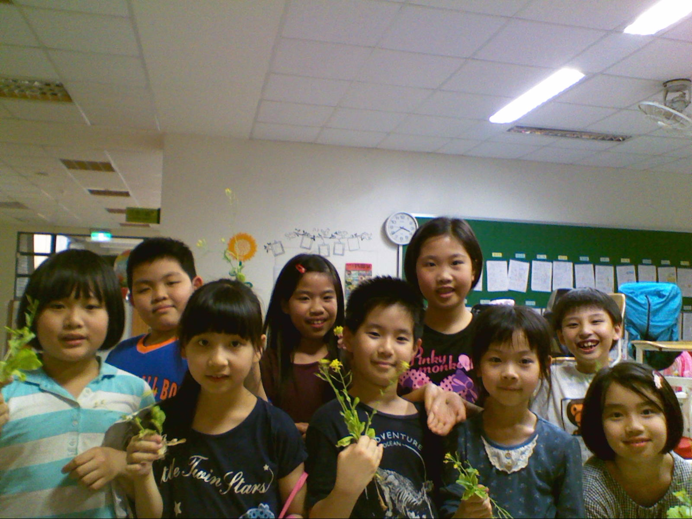
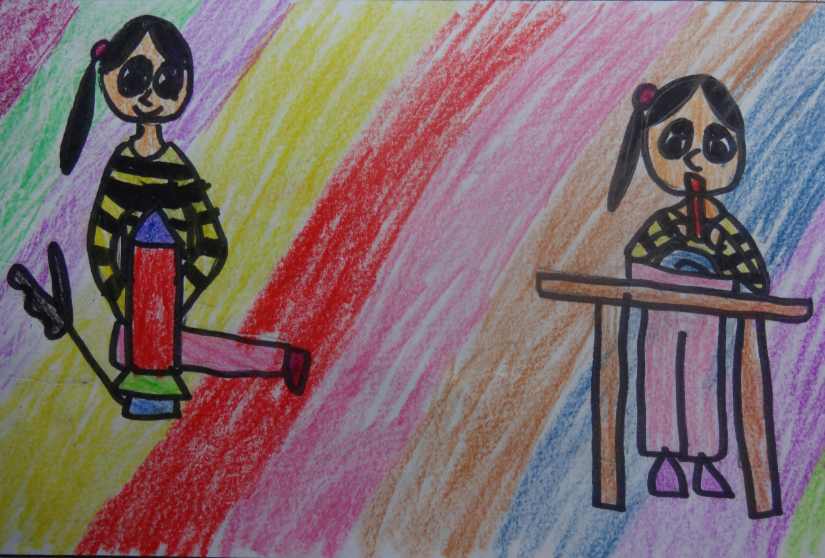
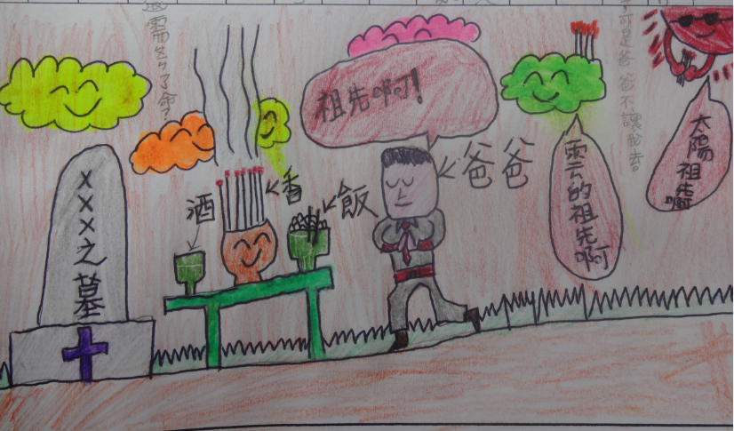
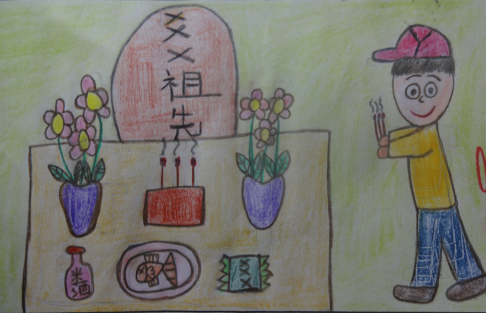
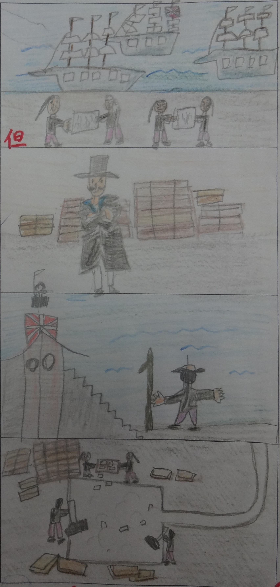

========
三年二班
========

<我的文藝新老師> 游祖恆
=======================
我的導師是楊淨雯老師，她戴著一副眼鏡，長得瘦瘦的，留著一頭短髮，看起來很嚴肅。

楊老師在教我們上課的時候，很著重語文，常常要我們抄佳句、寫短文、或是閱讀。同學都好厲害，而且老師會讓寫得很棒的同學站到臺前唸給大家聽。同學們上課有時很調皮，老師就會很嚴肅的糾正他們，可是我們表現很好的時候，老師會用獎卡或堅果來鼓勵我們。

楊老師，我想對您說，我喜歡上您的課，可是我對文章的理解力不是很好，雖然每次都要請安親班老師或媽媽幫忙提醒我，讓我順利的完成功課，可是我還是很努力的、用了很多的時間來完成每一篇文章，謝謝楊老師的認真批改與鼓勵教導。

<我的美麗新老師> 翁渝晴
=======================
我的音樂老師長得十分美麗、待人溫柔，她有一頭烏黑亮麗的頭髮，總是眉開眼笑，很辛苦的挺著大肚子來為我們上課。

上課時，她會教我們唱歌、吹笛子，也會讓我們玩遊戲，讓每個小朋友興高采烈的上課，也讓我沉醉在美妙的音樂旋律中，就像躺在草地上做白日夢，飛在天上做音樂夢，不但學會許多音樂方面的知識，也讓我的歌聲更美妙動聽。

我希望長大以後也能唱出優美的歌聲，和音樂做朋友，謝謝張秀雯老師的指導。期待你生完寶寶後，回來繼續教我們的日子趕緊到來。

<寒假生活樂趣多> 林靖堂
=======================
寒假期間，爸爸和媽媽要工作，又不能把我一個人留在家，因此爸爸讓我和他一起去送貨。爸爸工作的地方在台北港，負責把伙食送到船上。今天要送貨到一艘三百四十米長的船，名叫長連輪。因為船上許多設備都是用電腦控制，所以船員只需要二十二個人，他主要跑的航線是歐洲，跑一次要四十二天。一次可裝載八千五百個貨櫃，是目前長榮海運最大的貨櫃船。

當我們送完伙食後，爸爸帶我到駕駛臺參觀，我看到一望無際的海洋，非常興奮。我原本以為貨船的駕駛台會和車子一樣，沒想到多了許多按鈕和船長可以直接指揮大家的麥克風。

這次的送貨經驗，讓我了解爸爸的工作有多麼的辛苦，不但需要準時把貨送上貨櫃船，還要把貨放在對的樓層，要細心不出錯，真是不簡單。

<寒假生活樂趣多> 簡子芯
=======================
今天親戚朋友們大家齊聚一堂，主人展現誠意迎接客人─小堂弟來玩。

進屋一看，桌上放滿香香噴的茶點，我們迫不及待開始大快朵頤，鬆餅脆脆的，冰淇淋涼涼的。吃完下午茶，發現後面有個院子，院子裡有兔子、孔雀、公雞和小鴨，我聽見孔雀「ㄝㄝㄝ 」的聲音，公雞「咕咕咕」的歌聲，小鴨「ㄚㄚㄚ」叫，兔子吃白菜「喀茲喀茲」的聲音。突然一隻兔子跑過來，要跟我握手，兔子毛茸茸的，摸起來好舒服。

我最喜歡到後面的庭院玩了，小動物都跑跑跳跳的，那幅可愛的模樣，令我很難忘。這次與小動物玩耍，我體驗到小動物並不是想像中的那麼可怕、兇猛，牠們如果對人不友善，原因可能是人們曾經欺負過牠吧！

<歡樂滿行囊> 朱品睿
===================
十月十五日是我與同學們期待已久校外教學的日子，當天早上下了綿綿細雨，我的心情也因此七上八下，我很擔心會下大雨，影響活動的進行，直到上了遊覽車才鬆了一口氣。

到了花博公園，我參觀了最感興趣的典藏植物區。首先看到了生命樹，這是一棵保育人士從即將拆除的古厝內拯救出來的老樹，表現出植物的堅強的生命力以及人們對生命物種的尊重。另外，世界熱帶植物種子展和各種氣候帶的植物生態展，看到形形色色的植物，都讓我大開眼界，真有趣。

下午來到台北美術館參觀「迫聲音」音像裝置展，其中我最感興趣的是「同舟共濟」，影片中我看到了洪水的可怕，以及人們的力量是多麼渺小。影片真實的呈現，唯有人們互相扶持幫助，才能度過難關，生命才會更加美好。

出了包羅萬象的展覽館，大家七嘴八舌討論自己的新發現，捨不得離開，今天活動成功，同學們都期待著下次校外教學早日到來。

<歡樂滿行囊> 黃允
=================
期待已久的校外教學終於來到了，我們搭遊覽車抵達目的地，開始一天的旅程。

首先，我到花博爭豔館欣賞千奇百怪的盆栽展，真可說是讓我大開眼界，其中我覺得最有趣的是「佛手柑」，因為，展場各色各樣的盆栽中只有它才有果實，真像釋迦。之後，到明日世界看3D影片，3D科技使影片裡面的青蛙和蜻蜓好像都飛跳了出來，讓我看得目不轉睛，心臟也差一點蹦了出來，這真是個新奇的體驗。

下午，去美術館看了「迫聲音」的展覽，裡面有好多美麗的藝術品，其中令我印象最深刻的是「同舟共濟」，因為影片中許多位來自各行各業、不同種族的男女，突然受到洪水的猛烈攻擊，而藝術家利用慢速播放讓觀眾欣賞動作，水是一滴一滴的噴灑，讓我看得一清二楚，彷彿是彈珠滴滴答答的打在他們身上，真是特別。

這次的戶外教學真開心，導覽阿姨解說生動，讓我獲益良多。
  
<歡樂滿行囊> 陳致瑋
===================
期待已久的校外教學終於來臨，我帶著既興奮又緊張的心情，一路飛奔到學校。當天秋高氣爽，是個適合出遊的天氣。包子和水果是媽媽為我準備的午餐，簡單卻不失美味。

上午，我們到兒育中心明日世界看了黑蒙以及若亞的奇幻之旅兩部3D電影，影片內容寓教於樂，提醒人們愛護生命的重要。黑蒙一片中，青蛙群起跳出來的畫面，差點兒讓我嚇得魂飛魄散。接著造訪花博公園未來館，有許多稀有植物，色彩繽紛的緬梔和吃下去會肚破腸流的「魔鬼之爪」，都很吸引我的目光。

下午，我們去參觀北美館的「音像裝置展」。其中「五徑之辮」這件作品，最讓我驚豔。它是在地上貼了很多彩色交叉纏繞的線條，我們必須順著線條繞來繞去，同時邊走在線上還要邊律動，我很喜歡在彩線上遊走，如果能把那些線擺在真的路上，這個城市鐵定更多彩多姿吧。

今天是滿載而歸的一天，我不但見識到各種新奇的植物，也欣賞到許多精采的藝術創作。所謂「百聞不如一見」，希望下一次的校外教學趕快到來！

<游泳的喜悅> 謝昕佑
===================
我很喜歡上游泳課，因為游泳時泡在水中很涼快，還可以學到健康知識和新動作，我很好奇為什麼人可以漂浮和靠踢水前進。

游泳老師教我們仰式和自由式，我還另外跟一些同學一起游蛙式。第一次游的時候，我很我緊張，怕自己游很慢，結果老師說我可以升上十九級，我很開心。

學會游泳可以保護自己，以後還可以去學救生，這樣遇到別人溺水，就可以救人一命。這是我對游泳課印象最深刻的事。

我很喜歡游泳，很涼爽很愉快，上週是這學期最後一次上游泳課，考試內容是蛙式，我順利過關了，好開心。

<學校生活樂趣多> 楊振均
=======================
小朋友都必須上學，上學的意義是要讓我們學習到很多新知識，與人和諧相處的方式，增加我們的競爭力。

學校的學習活動中，我覺得上課的樂趣在於可以得到很多的新知，因為這樣可以讓我變得更聰明、知識變得更豐富。例如數學時，我可以在課堂上寫許多的題目，讓我很有成就感。有時，老師也會請同學上台解題或小組競賽搶答，刺激又有趣。

我曾經參加過學校的童軍社團，安排了各式各樣的活動，其中我覺得最有趣的是生火烤肉，因為我們可以利用美工刀，把木頭刮出木削，這樣可以方便木材點火，讓我非常入迷。

在學校和老師同學在一起生活的每一天，我期望自己可以提升自己的專注力，把握每一分、每一秒，讓我的學習更有效率。

<科學嘉年華> 劉耀元
===================
我懷著興奮的心情，迎接期待已久的科學嘉年華到來，這場嘉年華由元智大學多位大哥哥大姐姐的精采表演展開。

第一個表演是超大型吹風機，這一個吹風機可以把人像氣球一樣，吹得頭髮變形，大家看了都笑不停。我最喜歡的表演是乾冰滅火器，因為乾冰揮發的力量很強，只要把蓋子蓋上，乾冰汽化的二氧化碳就可以把火撲滅，好神奇。

九宫格則是我最喜歡的關卡，因為我對球類運動最拿手了，可以很準確的打中好幾格，每當我投進一格，我就會更想要再投進下一球，真是過癮。

經過了令人興奮的一天，我對這些表演背後的科學原理充滿興趣，老師建議我們可以到圖書館找相關書籍延伸學習，我希望將來成為一位幫人們解決煩惱的科學家。

<清明節有感> 陳柏霖
===================
清明節家家戶戶會祭拜祖先、掃墓，我們家會做潤餅當午餐，之後爸爸、媽媽必須上山去掃墓。

我們的祖先埋在遙遠的深山裡，爸媽從來沒帶我去過，但是我曾經從家族拍攝的DVD上看過長輩們掃墓的過程。他們舉香膜拜，口中念念有詞，希望祖先保佑大家健康平安，最後會用小石頭把墓紙壓在墳上。

我的祖先幾百年前從大陸福建省泉州市渡海到臺灣定居，我的曾祖父母在下塔悠種田，也在基隆河抓蛤仔，到市場沿街叫賣。我要謝謝祖先辛苦的工作，子孫才有安定的生活。

平常在家我都會向祖先的牌位膜拜，謝謝他們保佑我平安長大，希望明年爸媽會帶我去掃墓，親自體驗慎終追遠的習俗。

<清明節有感> 黃士軒
===================
我家的祖墳原本是在學校對面的山坡，後來因為開發就遷葬到金山的生命紀念館。阿公怕塞車，所以每年都在清明節之前就提前去掃墓。我們會先擺好祭品，每人點兩柱香，再開始祭拜，拜完後家族成員就下山找地方聚餐敘舊。

聽阿公說，我的祖先是清朝時從福建來到台灣的，之後便一直住在我的安親班欣兒園對面那一帶。阿公的爸爸因為識字，所以常常幫附近的人寫書信。阿祖叫做黃丙丁，以前住在大直、內湖一帶的人，提起他的大名沒有人不認識他的。

爸爸跟我說：「只要完成了上天請我們做的事情，就可以跟已經完成任務的人見面了。」我想，清明節是紀念祖先和祝福現在還在努力工作的親人，與他們相聚的日子。

<清明節有感> 張宇涵
===================
相傳漢高祖劉邦取得天下光榮返鄉後，想要到父母親的墳墓上去祭拜。但因為連年的戰爭，找不到父母親的墓。劉邦非常的難過，拿出一張紙，撕成許多小碎片，然後向上天禱告，其中有一片紙片落在一座墳墓上，他跑過去一看，果然是父母的墓。劉邦馬上請人重新整修父母親的墓，而且從此以後，每年的清明節一定到父母親的墓祭拜。其實，故事是假的，但這表示中國人是相當重視清明節祭祖習俗的。

清明節有一些習俗，像掛紙、吃潤餅等。掛紙又稱「壓紙」，一般用石頭或磚塊將長方形的黃白紙壓在墳墓上，表示子孫已經祭拜過祖墳。而潤餅是以麵粉做成薄皮，裡面包了豆芽菜、紅蘿蔔絲、豆干絲及蛋皮等，灑上花生粉及糖粉，捲成圓筒狀即可食用。

目前我家祖先的墓有專人打掃，這樣可以保持看起來整整齊齊的。我並沒有掃墓的經驗，掃墓都是由大人回南部參加。聽外婆說，我的外曾祖父是從大陸來的，他以前念中央警官學校，後來到台灣工作，認識了外曾祖母。那時住在警察宿舍，全家人擠在一起，米也是配給的，生活相當簡僕。

清明祭祖除了慎終追遠，還能凝聚家族間的感情。但我們對祖先的崇敬，不只是在墳前供奉祭品，還有除草掃墓而已，更重要的是要牢記祖先的教誨和發揮祖先的美德，這才是清明節真正的意義。

<清明節有感> 許永達
===================
周朝時，王室和貴族定期在宗廟舉行祭祖大典，而平民則沒有宗祠可以祭祀祖先;到了秦代，掃墓才變成為中國人代代相傳的習俗。

清明節當天，我們準備掃帚、鐮刀、水果、五色紙、蠟燭等用品，浩浩蕩蕩前往墓地。掃墓時，首先要整理墓地，用鐮刀割除雜草，用鋤頭砍去雜樹灌木的斷根，再將墳前的墓庭打掃乾淨，才能擺放祭品，進行掃墓儀式。

我的阿美族外公說：「在很久以前，天空上原本有十個太陽，阿美族不堪熱，沒有水喝，農作物也長不出來，婦女們決定織布，用布匹來捕捉太陽，將布織成一片網子後，他們佈下天羅地網，太陽很害怕，變身成星星和月亮，為了謝謝她們，就變成所謂的母系社會。」我這才知道母系社會的由來。

阿美族這種母系社會已經很少了，謝謝外公告訴我先祖的故事。清明節是慎終追遠的日子，了解祖先的事，對自己的生命就會更了解，因為沒有他們，就不會有我的存在。

<蛋糕好滋味> 陳紫綺
===================
今天是母親節，我選了茘香草苺蛋糕送給媽媽，因為我覺得這款蛋糕造型很特別，擺上像小皇冠的巧克力，還有五彩繽紛的水果，讓人看了忍不住就愛上它。

巧克力皇冠如果戴在媽媽的頭上，會讓媽咪好像一位高雅的皇后，站在廣場前接受大家的祝福。五顏六色的水果，好像一群舞者，揮動著彩虹般的綵帶，為溫馨的母親節祝賀。

淡淡的荔枝和香草香味撲鼻而來，不禁令人食指大動，軟軟鬆鬆的蛋糕入口即化。冰涼的水果，則讓身體瞬間舒暢，火氣全消。

媽咪謝謝您平日的細心照顧，送個小蛋糕給您，希望您天天都是母親節。

<秋天是什麼> 郭倢伃
===================

::
    
    努力的設計師說，
    秋天是美麗的衣裳，
    但它一下厚一下薄，
    忽冷忽熱害大家感冒。

    漂亮的名模說，
    秋天是沈魚落雁的美女，
    樹葉看到它，
    臉都紅了。

    也有人說，
    秋天是貼心的好朋友，
    清晨時，
    陪老人舒爽做運動，
    夜晚來臨時，
    與我享受清涼的微風。

    我覺得秋天是魔術師，
    變出有趣的事物，
    讓大家有新感受及好心情。

小白菜開花了
============

    
    302 小園丁

科學嘉年華
==========

.. figure:: 302/02.jpg
    :align: center
    
    楊振均

    翁渝晴

清明節有感
==========

    
    黃亮鳴

    
    楊振均

林則徐禁鴉片
============

    
    楊盛硯

