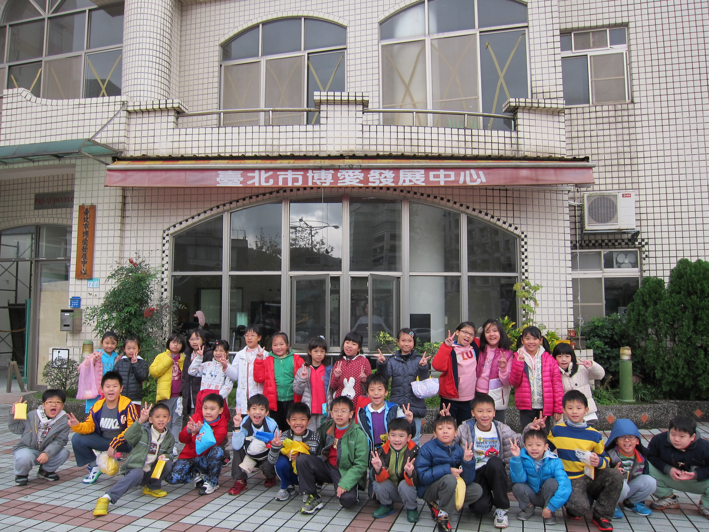
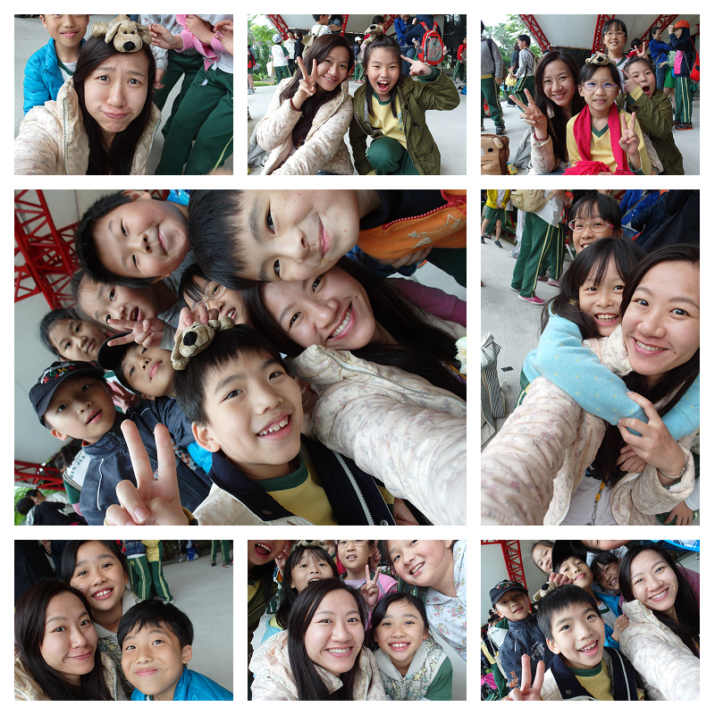
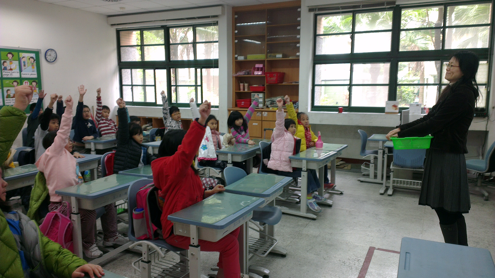
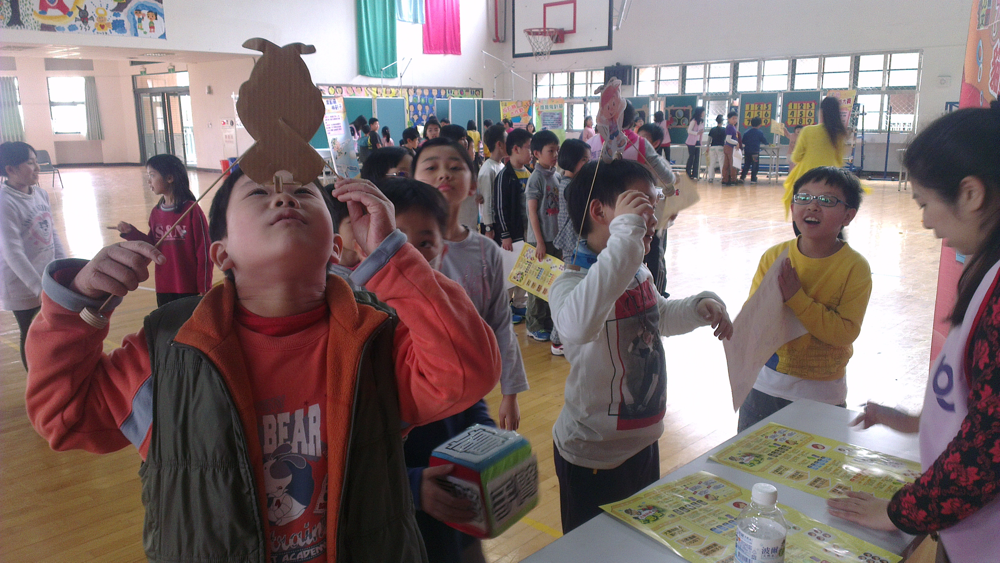
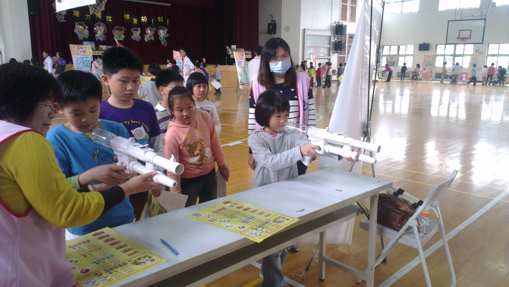
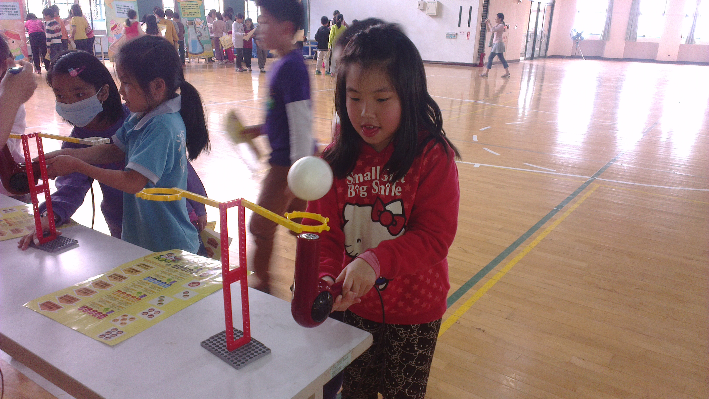
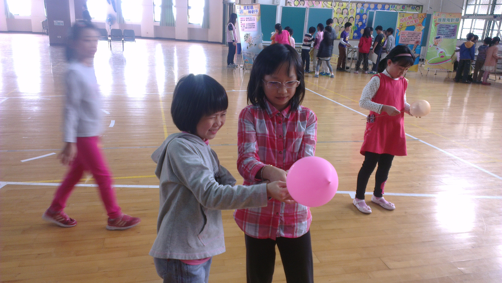
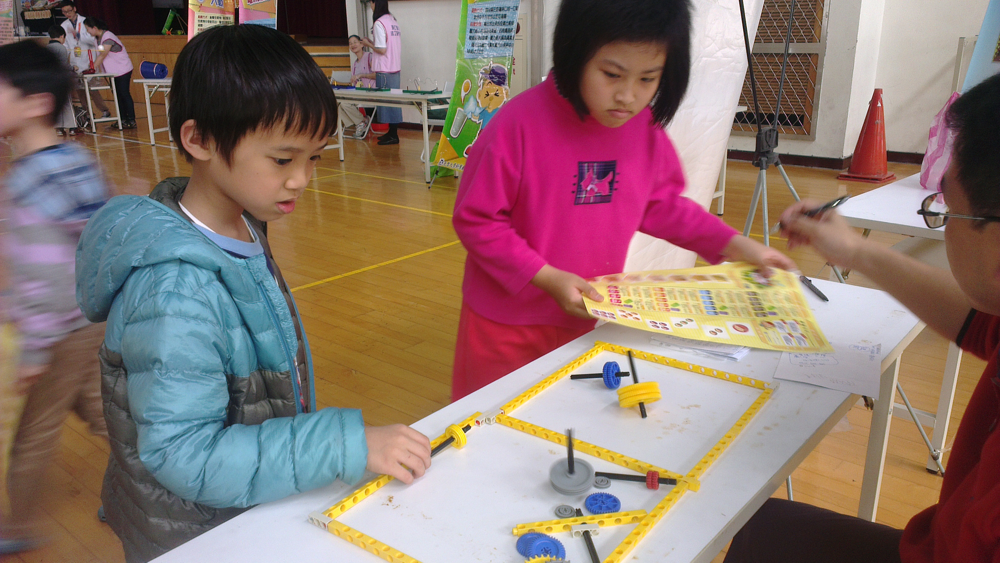

========
三年四班
========

照片集錦
========

.. figure:: 304/1.jpg
    :align: center

    花博公園的寶特瓶建築好壯觀啊

.. figure:: 304/2.jpg
    :align: center

    美術館的氣質之旅

.. figure:: 304/3.jpg
    :align: center

    我們在三年級大隊接力中榮獲班際比賽冠軍

    博愛發展中心是社區的好鄰居

.. figure:: 304/5.jpg
    :align: center

    台大農場認識健康的飲食好習慣

.. figure:: 304/6.jpg
    :align: center

    校外教學的午餐時間是我們最期待的野餐

.. figure:: 304/7.jpg
    :align: center

    校外參觀時我們喜歡勤作筆記

    我們都是老師的寶貝

.. figure:: 304/9.jpg
    :align: center

    這是我們親手種的薄荷和薰衣草喔

    輔導室的性別平等課程讓我們獲益良多

.. figure:: 304/11.jpg
    :align: center

    今年的園遊會真是精彩極了

.. figure:: 304/12.jpg
    :align: center

    園遊會時，我們都是盡心盡力的小老闆喔

.. figure:: 304/13.jpg
    :align: center

    我們是小小音樂家，隨處都是我們表演的舞台

    科學闖關遊戲—在鼻梁上玩翹翹板，很酷吧

    科學闖關遊戲—看我用看空氣槍瞄準，發射

    科學闖關遊戲—哇！保麗龍球在漂浮耶

    科學闖關遊戲—咦？這個氣球戳不破嗎

    科學闖關遊戲—小陀螺，轉啊轉！看誰轉的最久

<濱江文學賞觀後感> 歐桓瑜
==========================
一年一度的濱江文學賞又在聯合辦公室舉行了。一篇篇的作品伴著母親節園遊會映入大家的眼簾，也藉此向大家展現出濱江國小學生的文學能力。

第一站，我們來到低年級的作品專區，我一眼就看上了郭騏勝的<媽媽像……> 的作品，他的文章中用了一些譬喻法，例如：媽媽像吸塵器、媽媽像超人……等，這篇作文讓我發現，原來天下的媽媽都一樣，那麼愛自己的兒女，也那麼的辛苦。
    
第二站，我走到四年級一面面的展示板前，正當我猶豫不決，不知道該選哪一篇文章時，一篇令我看得心滿意足的文章就被我找到了，那就是黃詩芸的<小狗的自述> 的作品，其中有一段這麼寫到：「我是一隻快樂的小狗，我有一顆快樂和善良的心，會帶給主人快樂，汪汪汪！我是好狗狗。」文章裡面把小狗擬人，讓小狗說出心裡的話，正好也貼近我想養狗的心境。

最後一站，大家走到五年級琳瑯滿目的作品前，我一轉頭就看到黃品恩那五彩繽紛的<戀戀基隆河> 的作品，那優美的辭句，讓我看得目不轉睛，在其中我選了一句佳句，上面寫到：「寧靜而優美的基隆河，如藍色的緞帶，陪著大台北地區，緩緩投入淡水河的擁抱。」，這一篇文章中，寫出了基隆河的經歷，也用擬人法讓大家認識這段經歷。

在這次文學賞中，不只有這些五花八門的文章，還有一項作品也十分耀眼奪目，那就是六年級的大哥哥、大姐姐們所精心設計製作的「時光隧道」，裡面都是他們許許多多的回憶。此外，我也學到了：不只寫作是一門學問，欣賞他人的文章，也是一門不可缺少的學問呀！

<濱江之美> 黃晧維
==================
濱江國小是一個美麗的童話王國，裡面有許多豐富的生態。在濱江國小裡，我最喜歡的是漂亮的水滴廣場上的小水滴，仔細一看，小水滴上有刻劃著精彩的紋路喔！天晴時，天空映在水滴上，看起來就像一顆清澈的藍寶石，讓人看得目不轉睛。小水滴旁的木棉花，一朵一朵就像羽毛球一樣可愛。只要我看見小水滴，鬱悶的心情就會豁然開朗。濱江國小是一個充滿歡笑的地方，更是一座知識寶庫。

<濱江之美> 陳妍蓁
==================
濱江國小是一個美麗的水岸王國，我最喜歡的地方是生態池，因為每到下課，總有非常多的小朋友在這裡玩，這邊彷彿成了熱鬧的遊樂園。此外，還有許多可愛的小生物在這裡聚集，偶爾可以聽到小鳥們和青蛙在比賽唱歌，蝴蝶也會穿上繽紛的舞衣，在我們頭上翩翩飛舞，美麗極了！當我煩惱的時候，就會來這裡散散步，煩惱也會因此拋到九霄雲外呢！

<濱江之美> 蔡季妍
===================
濱江國小是一座美麗的水岸王國，我最喜歡的地方是生態池，那裡就像孩子們的快樂天堂。每到下課時，都能聽到歡樂的笑聲，再仔細聽的話，還能聽到牛蛙大合唱呢！這裡還有石頭鋪著的步道，讓我們可以穿梭在生態池裡玩耍。在一旁的大樹，就像英勇的衛兵，守護著我們的校園。生態池旁的紅花，就像穿著彩衣的蝴蝶翩翩起舞。這裡裝著我滿滿的回憶呢！

<謝謝> 袁沛薇
===============

::

    月亮謝謝星星，
    陪他照亮黑暗的夜空。
    小羊謝謝草原，
    讓牠可以自由自在的奔跑。
    蒲公英謝謝風兒，
    讓它的種子可以四處去郊遊踏青。

    下課時，
    我要謝謝要好的朋友，
    時常陪我玩耍，
    讓我不會孤單寂寞，
    和我一起創造美好的童年時光。

    下雨時，
    我要謝謝親愛的爸媽，
    為我送上一把關愛的傘，
    讓我不被冰冷的雨水淋溼，
    可以安心的走路回家。

    上學時，
    我要謝謝辛苦的導護志工，
    不管晴天或雨天，
    每天守在車水馬龍的路口，
    用她的笑容守護我們上學。

    謝謝您們，
    用愛伴我長大，
    讓我的生命每天都幸福而快樂。

<謝謝> 柯志翰
==============

::

    烏龜謝謝河水，
    讓牠舞了一曲又一曲的漣漪。
    太陽謝謝月亮，
    陪他一起不眠不休的工作。
    小鳥謝謝大樹，
    讓牠有個溫暖的家。

    下課時，
    我要謝謝要好的朋友，
    陪我玩好玩的遊戲，
    一起去圖書館看書，
    讓我的下課時光充滿歡笑。

    生病時，
    我要謝謝辛苦的爸媽，
    特地早早回家，
    為我煮好吃的稀飯，
    徹夜的照顧我。

    上課時，
    我要謝謝辛苦的老師，
    教導我們新知識，
    也會帶著我們增廣見聞，
    讓我們變成有學問的人。

    謝謝您們，
    用愛伴我長大，
    讓我的生活變得有趣而豐富。

<謝謝> 蔡宜晏
===============

::

    兔子謝謝草地，
    讓牠能在其中盡情的跳躍。
    大樹謝謝啄木鳥，
    幫牠捉出身上的小蟲。
    人類謝謝森林，
    讓我們可以呼吸到新鮮空氣。

    受傷時，
    我要謝謝互助的朋友，
    扶著流著淚水的我，
    陪伴我去保健室擦藥，
    讓我能安心的回教室。

    晚餐時，
    我要謝謝疼愛我的爸媽，
    即使流著一身汗，
    仍煮出熱騰騰的飯菜，
    讓我能盡情享用美味的佳餚。

    上課時，
    我要謝謝親愛的老師，
    用心告訴我人生的道理，
    還教導我許多新知識，
    為我打開知識的大門。

    謝謝您們，
    用愛伴我長大，
    讓我的每一天都能快樂又平安。

<清明節有感> 賴奕辰
=====================
掃墓乃是清明節最重要的一種習俗。子孫們先將祖先的墳墓及周圍的雜草修整，供上祭品、鮮花等。所以清明節最基本的儀式是到墳前、骨灰放置處追念祖先。

四月四日一早，爸爸、阿嬤跟姨婆，開車從台北到羅東掃墓去，因為阿公身體不適，所以我跟媽媽留在台北照顧阿公。爸爸跟我說，他們一到墓園，先將雜草一一剷除，之後將墓紙壓在小石頭下，接著點香向祖墳敬拜，請祖先享用祭品，並祈求祂庇佑家人平安健康、工作順利，最後焚燒紙錢後，掃墓才算結束。

聽爸爸說，阿公小時候母親很早就過世了，曾祖父在羅東林管處上班。阿公常常想念他的媽媽而偷偷掉淚。曾祖父對阿公的管教很嚴格，功課成績不理想，一定是教鞭伺候。之後隨著時間慢慢的成長，阿公也在林管處服務，服務期間還曾榮獲「模範勞工」的殊榮，所以阿公很感念曾祖父對他的栽培。

「慎終追遠」是中國優良的傳統，也是我們對祖先的追念之情。所以我們要珍惜跟親人相處的時光，即時盡孝道。

<校園最美的角落> 袁沛薇
==========================
濱江國小是個位在基隆河畔上的美麗城堡，每天總是有著小朋友的歡笑聲，讓校園變得很熱鬧；老師的教學聲，也讓教室裡充滿了許多知識。

種著許多樹木和可以聽到像天使般的鳥叫聲的生態池是校園最美麗的角落。在那裡，抬頭可以看到蔚藍的天空，有時還有小動物，如：蝴蝶、牛蛙……陪我們玩耍。

而讓我最有感情的地方就是教室了，那裡是我獲得最多知識的地方，我的老師和我的好同學都在一旁陪伴我學習，心裡就會感到很充實。在這裡，我也交到許多好朋友，我們互相幫助、學習，讓我們的生活更多彩多姿，就好像生活在一個大家庭裡，每天都很快樂。

濱江國小是個美麗的天地，這裡有和藹可親的老師，陪伴我學習；活潑的同學，和我一起玩，我很高興能在這美好的地方學習。

<校園最美的角落> 歐桓瑜
===========================
我覺得濱江國小是一個美麗的園地，裡頭充滿了歡樂的笑聲，下課時有人拿起象棋一較高下；有人拿起來各種球類到操場打球；也有人兩手空空到校門口玩鬼追人，這麼多種遊戲，讓我們下課時一點都不孤單無聊。

這麼美麗的園地，當然也要有我覺得視覺最美的地方，那就是「水波遊戲場」，一到晚上，水波遊戲場的燈亮起，就有如漂亮的水舞一般。

而讓我最有感情的地方則是濱江附幼的沙坑旁，那裡有一棵桑葚樹，每當三~四月時，我總是在下課時跑到那裡採些桑葚來吃，我小時候也常在旁邊的階梯上觀察蝴蝶呢！

我在學校裡有很多人跟我做朋友，我也很喜歡這個學校，這裡有著我許多的回憶。

<我的朋友樹> 杜奕葶
=====================
每當心裡感到難過時，朋友總會給我安慰；每當受傷時，朋友總是陪我到健康中心擦藥；每當有開心快樂的事時，朋友都會與我一起分享我的喜悅。所以朋友在人生中扮演的著很重要的角色。

對待朋友時，要尊重他的想法，時常關心他的近況，更要信任朋友，不要懷疑他，同時也要包容不一樣的個性。

沛薇是我在班上的好朋友，她總是熱心的幫助我、支持我。眈妉是我一、二年級時的好朋友，儘管她到加拿大讀書，還不時寫信給我。宇涵是我在社團裡的好朋友，我們常常一起切磋舞技。

在生命中，朋友的陪伴是無比重要，不管難過、受傷或者快樂，有朋友的安慰、支持、分享，總是會為我們的人生增添更多色彩，所以我們要更珍惜這些得來不易的友誼。

<歡樂滿行囊> 林承勳
======================
令我迫不及待的校外教學終於來臨了，我一想到就興奮不已，到教室時，大家早已歡天喜地的聊著天，準備出發。

一出校門，大家帶著興高彩烈的心情上車，一下子就達到我們今天的目的地─花博公園。第一站我們來到了未來館的植物園區，園區裡有著林林總總、各式各樣千奇百怪的植物，真是讓我大開眼界。其中令我印象最深刻的是鐵十字秋海棠，因為它的葉子上凸出許多尖尖刺刺的針狀物，有趣極了！

出了植物園區後，天空突然下起毛毛細雨，大家便趕緊跑到下一個參觀定點─行動夢想館。一進入行動夢想館，工作人員發給我們一人一台夢想時光儀，大家拿到後便目不轉睛的操控著時光儀上的小遊戲，玩得不亦樂乎呢！最後，我們欣賞了360度的影片，手上的夢想時光儀突然發射出五光十色的煙火呢！

午餐後，我們走到了美術館參觀，我看到了各式各樣、五花八門的作品。導覽老師先帶我們去欣賞一個叫<天使的墜落> 的裝置藝術作品，在黑漆漆的房間裡，只看到一束紅色的光射在水面上，後方還不時有一大堆的霧氣冒出來，看起來有些恐怖！另外，我們還看到了數不清的水袋綁在一起，遠遠看，就像一顆亮晶晶的大鑽石，這也是我們大家公認最漂亮的作品了。

時間飛逝，又到了準備回學校的時間了，大家感到依依不捨又意猶未盡。這次校外教學，豐富了我們許多新的知識，讓我們朝「智多星」又更邁進了一步囉！

<學校是什麼> 陳奕安
=======================

::

    不喜歡讀書的人說，
    學校是烏漆抹黑的洞穴，
    那裡有著兇猛的老師，
    老師生氣的模樣嚇得令人魂飛魄散。

    喜歡上學的人說，
    學校是快樂天堂，
    有充滿魔力的老師，
    也有很多具有天馬行空想像力的學生。

    也有人說，
    學校是歡樂的遊戲天堂，
    有著充實的下課時間，
    讓我們在操場上盡情的追逐玩耍。

    我覺得學校是魔法城堡，
    可以讓我們有一個聰明的腦袋，
    也可以讓我們學習到各式各樣的知識。

<拜訪社區> 賴奕辰
===================
學校因為想要讓我們更瞭解社區，特地帶全三年級去土地公廟和里長辦公室參觀，使我們更加明白居住地方的特色。

當我們一進去土地公廟，映入眼簾的就是各式各樣的雕刻作品，廟門上的四大天王、壁堵上的忠孝節義故事，都是寺廟精心打造的，每項裝飾都栩栩如生呢！

接著，我們去拜訪金泰里的游里長，並且和里長有一個座談會，大家踴躍發表問題，里長叔叔也很熱心的一一回答。里長還跟我們分享他曾經協助警察拾獲一把手槍的事件，讓我們聽得目瞪口呆。真的很感謝里長熱心的為居民服務及奉獻。

這次的社區拜訪，真是讓我受益良多，我們要有良好的居住安全及生活品質，大家一定要彼此分工合作，才能讓我們在無憂無慮的環境下快樂的生活。

