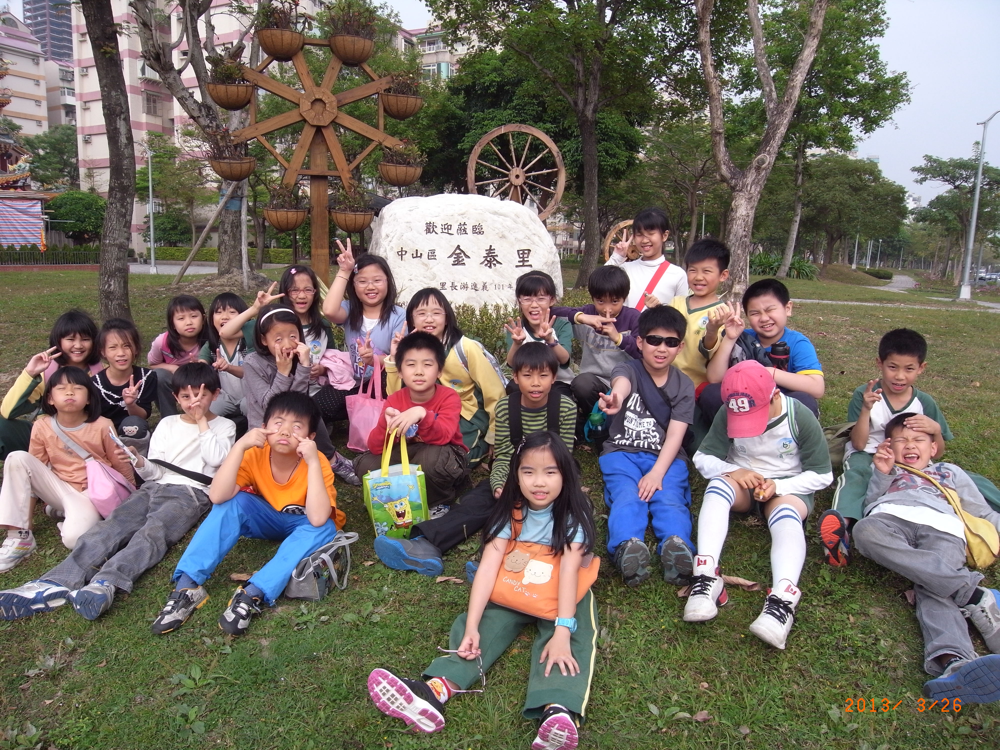

========
四年一班
========

全班大合照
==========

<螞蟻草原大進攻> 周冠霖
=======================

::
    
    令太陽公公怒氣沖天的夏天，
    小小一隻螞蟻，
    在]草原上爬上爬下的，
    看起來很忙碌，
    是累了嗎?
    是熱了嗎?
    爬上爬下到底是為什麼?
    原來是在向小草揮揮手，
    把小草搬回家做客。

<花瓶的自述> 范中綺
===================

::
    
    花瓶的自述
    我是個外表剛強，
    內心軟弱的花瓶，
    每當我心裡的蓓薈開了花，
    心裡是多麼的喜悅。
    每當我的家人被小狗打破，
    心情是多麼傷心。
    但當主人細心照顧種在我心裡的花兒時，
    心中卻充滿了溫暖。
    只要跌倒了，
    就可能摔得遍體鱗傷，
    甚至粉身碎骨。
    但只要你好好照顧我，
    我就不會受到別人的傷害。

<風的自述> 李昊庭
=================

::
    
    平時我非常溫柔，
    煩惱時 原地打轉，
    生氣時 無人能擋，
    傷心時 無比瘋狂，
    有時我受大家喜愛，
    有時我使大家受害，
    有時開心，
    有時傷心，
    我的心情喜怒無常。

<戰鬥機的自述> 林子於
=====================

::
    
    我是ㄧ架防衛國土的超級戰機，
    我是ㄧ架飛的比誰都還快的戰機，
    我是ㄧ架不怕子彈的戰機。
    我擁有先進戰鬥機配備和性能，
    我更具有夜間戰鬥能力，
    雷達、飛彈、隱身都是我的功能。
    有時，我還擔任偵查任務的無人機，
    未來的我將游走太空，
    就怕殞石撞了我！

<動物園一遊> 陳熙  
=================
今天是校外教學的日子，全體四年級都整裝待發，今天晴空萬里很適合郊遊。沿途的景色宜人，令人目不暇給，還有高大的台北101大樓，到達目的地後，我才後，我會變形。我們進了動物園後，有各式各樣的動物，蒙古野馬帥氣地英姿，及牠奔馳在草原上的速度，好像一枚飛彈，據說，蒙古野馬是一匹千里馬喔!犀牛的糞便，可用一鳴驚人、臭氣熏天來形容，而牠強壯的身體，和牠強而有力的牛角，真是搭配。還有可愛的小猴子在樹上盪來盪去，像位矯健的運動員，還不只這些，林曳、企鵝、貓熊、獅子……但是卻沒有看到圓仔，真可惜。這次的動物園校外教學，不僅讓我收穫滿滿，也讓我舒展了一下筋骨

<媽媽的手> 張郁苓
=================
白白的手，粗粗的手，雖然她白白、粗粗的，可是她是全世界最偉大的手。這雙偉大的手用照顧、呵護我們、工作、賺錢……。

這雙偉大的手背後的辛苦到底是什麼呢？其實這雙手可是很忙碌的。她每天要工作賺錢，一整天忙完之後，還要做家事，這些都做完之後，還要再打開電腦工作。這些忙碌的事情天天上演，所以我應該要好好珍惜、愛惜這雙手。有一點我覺得很不應該，因為不管媽媽在休息或忙碌中，她叫我練習樂器，並且鼓勵我，可是我還是不練習，我這樣一定讓那雙辛苦的手變得更加無助又失望了吧！

感謝那雙偉大的手對我的付出、照顧。我一定會好好愛惜你，也希望你不要那麼辛苦、忙碌，可以有多一點的時間休息。

<媽媽的手> 游若均
=================
從小到大，媽媽每天都忙著張羅家裡的大小事，那一雙手，既厚實又溫暖，但摸起來卻十分粗糙。小時候，不管發生甚麼事，只要握著媽媽的手，就讓我很有安全感。

記得某一天晚上，家裡忽然停電，媽媽知道我怕黑，立刻跑到我房間來陪我，抓著媽媽的手，彷彿就在黑暗中，看見一盞明燈，讓我感受到媽媽的熱心與溫暖。媽媽雖然不用上班，但仍像勤勞的螞蟻一樣，每天忙進忙出，早上一早起來，幫我們做早餐，帶我們去上學，之後還要去買菜、做家事，晚上還要做晚餐、洗碗盤，但是媽媽卻從來不喊累。

媽媽的那一雙手，為家裡無怨無悔的付出，有時甚至還要幫忙我畫海報、做道具。那雙手，雖然粗糙，但卻給家人滿滿的愛。那雙神奇的手，就像有魔法般，陪伴、呵護著我長大，我想要永遠緊握著那雙溫暖的手─媽媽的手

<我愛媽媽> 洪宇辰
=================
「洪宇辰!你給我過來……….」 又聽到媽媽的大嗓門了，這就的媽媽，除了講話很大聲之外，頭髮短短捲捲的，眼睛大大的，講話也很愛重複三四遍，聽到我都快要會背了。

我的媽媽很厲害，我們家的三餐都是他親自幫我們準備的，而且她準備的菜色常常變化萬千，又很有創意，很多都是外面餐廳看不到的菜色.我最喜歡跟媽媽打桌球，常輸一場贏一場，這樣很難分出勝負，讓我覺得很刺激.而且她常常做出很好笑的動作，令我捧腹大笑.我媽媽也常常幫我訂閱課外讀物，讓我增加知識，視野也更寬廣。

從我出生開始，媽媽就含莘茹苦，終於把我養大，我一生都難以報答母親的寸草吋暉，所以我要做個聽話的孩子，不讓媽媽擔心，不讓媽媽生氣，讓媽媽天天都很開心。

<親愛的老師> 陳玉翎
===================
世上有著許多不同的老師，有的老師外表嚴肅，內心卻很善良；有的老師大智若愚，學生都被他管的服服貼貼；有的老師幽默風趣，但很有原則，每種老師都有自己的優點。

我的老師屬於幽默風趣的，她很少對我們大聲罵，總是和顏悅色的跟我們說話。但我們的老師可不好欺負喔！要是不聽話的同學想偷懶，我們老師可有辦法制止他，就像孫悟空逃不出如來佛的手掌心。我們老師不常生氣，如果在班上調皮搗蛋，老師還能忍受，但在科任班上胡鬧，那老師可會變成一隻母老虎，我們的日子可就不好過了！

當老師其實並不容易，不但要把自己的知識教導我們，還必須忍受我們的頑皮。因此，我們因該謝謝老師的春風化雨，使我們收穫良多。

<十歲的賀禮> 陳冠勳
===================
十年前，我事一個孩不會走路，也不會說話，每天就只會哇哇大哭的小娃兒；現在不只會走路，甚至還能賽跑呢！不用說是講話，還能跟外國人對話呢！十歲了，我要送什麼禮物給自己呢？

第一個禮物，我要送自己「走遍全世界」，我要用這個禮物走遍全世界，帶我了解更多文化，並充實自己的生活、增廣自己那無限的知識與見聞。第二個禮物，我要送自己「交破百個朋友」，我希望能夠因為那些良朋益友，讓我改掉我的缺點，病去學習別人的優點，使我一直進步，再也見不到那些暴躁的脾氣、那些傲慢無禮的態度，表現出真正成熟懂事的自我。

棒球明星陽岱鋼說過：「堅持不放手，夢想到手。」我也要秉持堅持的態度，並試著把給自己的禮物打開，也試著善用自己的禮物，一定能實現夢想。

<母親節園遊會> 朱祐緯
=====================
Happy Mama’s Day. 精彩的園遊會雖然過去了，但是我還仍記得我印象中最深刻的事。

園遊會剛開始，我走著走著……，看到了我們四年一班的攤子，所以想要試玩我們這一班的遊戲攤，我立刻掏錢出來，遊戲開始，第一球，我失手了，第二球，球慢慢滾下去時，這時我出手，揮棒落空，第三球，我雖然打到了，結果，沒破，三陣出局，我真的很不甘心，於是，花了錢，再繼續，但又被出局，每當出局時，就會很不甘心，所以錢就一直花下去，直到第三局的最後一球，我的棒子一打，水球就「ㄅㄨ ㄗ」的爆出來，這次總算甘心了，雖然打到了，但我的錢也快沒了，我最後就用這一點錢拿去吃吃喝喝，開心的度過這個園遊會。 

<媽媽的手> 詹安允
=================
媽媽─是每一個家庭最重要的人之一，每天手忙腳亂不停的工作，我現在就要介紹我的媽媽了。

我媽媽每天都很早起床，先用外婆教媽媽的用椰子油漱口，漱完口後，馬上就去做飯了，做完又去整理一服，這還不做完呢!又要帶我去學校並且洗完碗才算做完了。(每個星期四還要去教韓文呢!)

媽媽的手就像神奇的魔術師，我需要什麼都會變出來；媽媽的手就像辛苦的蜜蜂，每天都忙著做家事；媽媽的手就像溫暖的暖暖包，在我傷心的時候，會來安慰我，讓我的心更加暖和起來了。

我想到媽媽這麼辛苦的照顧我，我很感謝，並且我想跟媽媽說!「兒愛你啊!沒有你多麼悲傷痛苦阿。」

<水的魔術師> 郭安庭
===================
水是百變的魔術師，他能把自己藏起來，也可以把自己有趣的玩具，更可以幫忙大家清洗物品。

水是生活中不可缺少的，沒有了它，就等於沒有了生命。水可以幫助我們做許多事，它可以變成勤勞的清潔人員，把碗、衣服，甚至把世界各個角落都洗得清潔溜溜，細心的照顧我們，並滋潤大地，孕育許多奇特的生命。水就像一位厲害的廚師，它能把米煮成又香又軟的飯，也可以煮出一鍋香氣四溢的湯，更可以泡出一杯熱騰騰的茶。水還是一位冰雕師，它可以雕刻出千奇本怪的冰雕，把大地打扮的更加美麗。水是游泳教練的助手，幫助我們游得得心應手。水也是熱情的店員，每當食物蒸熟時，它就興奮的跳出來迎接客人。

水就像魔術師，讓大家生活變得加方便，也讓萬物都充滿蓬勃的朝氣。

<水的魔術師> 郭子綺
===================
水，是什麼呢？是令人爽快的冰棒？還是在天上飛舞的雪花？或是一望無際的大海洋呢？水到底是什麼角色呢？

水，是一位歌手，能唱出悅耳的歌聲；水，是一位心靈點通師，他用生因化解許多想做出傻事的人；水，是魚兒們的媽媽，它陪伴魚兒一生一世；水，是孩子們的玩伴，他跟著孩子們一起玩耍；水，就是地球的必需品。

水，是一位善變的巫婆，滅了我們的家鄉、製造颱風襲擊我們；水，是無形的殺手，奪取我們的生命財產。水，心情時好時壞，一下成了好朋友，幾天後卻變成了的人。水，還真善變啊！

水，在高溫下變成了水蒸氣，在南極變成了冰塊，在冬天變成了紛紛飛舞的雪花。水，真是神奇的魔術師，千奇百變！

<十歲的賀禮> 楊韶恩
===================
  
十年前的我，是一個很愛哭的小娃娃，那時我只要一哭，身邊其他的小孩也會跟著哭，所以大家都叫我『班長』。

但是現在的我已經十歲了，和當時那無知又愛哭的小孩子不一樣了，現在我已經是一位愛笑也愛玩耍的四年級小學生了！

十歲了，我要送給自己兩樣禮物，第一，我可以一天看三本書，因為我在十歲以前，我可以整天都不看書，而且要別人唸給我聽，我才想到要去看書；第二，我還希望我可以自己做出午餐或晚餐，因為爸媽不在時，我可以照顧我自己，不讓父母掛心。「人因夢想而偉大」，所以我要努力完成我的夢想。

十歲的我變得更聰明，也懂更多知識，希望未來的我，能更有學問，而且還變得勤勞，還要每天寫完功課，所以，我要多看書，也要專心上課，不要讓父母操心，這些就是我給自己的禮物。 我希望我能打開這些禮物，並善用他們。

