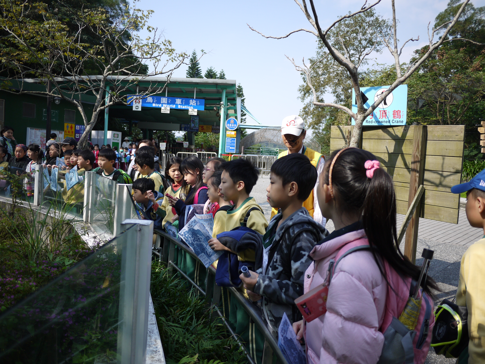
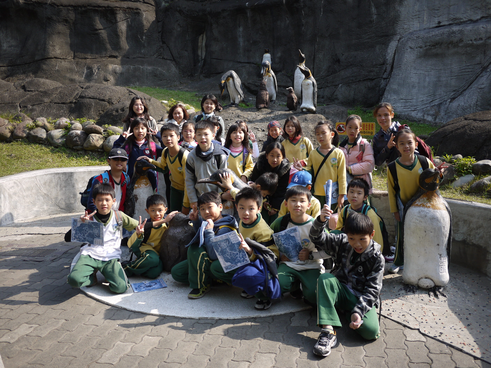

========
四年二班
========

郭正瑩老師的話
==============
這是四年二班的生活點滴記錄，一起分享心情的園地。看見孩子們的成長，一起共度喜怒哀樂，心裡也充滿欣慰。

<狗> 顏培軒
===========

::
    
    狗是我們的開心果，
    我們不開心時，
    會在我們身邊陪伴我們。
     
    狗是厲害的守衛，
    在危急時，
    他們會奮不顧身的來救我們，
     
    狗是人類的夥伴，
    每當我傷心時，
    狗永遠都會默默的在我身旁，
    陪伴著我，
    讓我覺得很溫馨，
    讓我體驗到溫暖的感覺。
     
    雖然狗不能陪伴我們一輩子，
    但時間這些也是狗的一輩子，
    所以我們要好好愛惜牠喔！

<親愛的老師> 孫震澔
===================
我們的老師，有一雙迷人的雙眼，可愛的鼻子，還有棕色的頭髮， 她對我們班的同學很好，她姓郭名正瑩，是我們的班導師。

老師有時會嚴厲一些，像上課時，有些同學很吵，就會被老師扣分;表現好的時候，老師也會幫大家加分。老師上課很認真教學，我們有不懂的地方，老師就會解釋給我們聽。老師教導我們，增加許多知識，在特別的節日裡，還會請我們吃東西，大家都很開心。

我們有這樣的一位好老師，應該尊敬她，用功讀書，才不辜負老師對我們的期望。

<動物大觀園> 王姿勻
===================
你知道我們今天校外教學要去那裡嗎？我們要去的是讓所有小朋友都能大開眼界的動物園，我迫不及待的搭上遊纜車，一路上有說有笑、笑聲連連，好不熱鬧！

到達動物園，四處人山人海，於是我們便興奮的走進這令人驚嘆連連的動物園。坐上遊園車，一路上微風徐徐吹來，似乎是在告訴我，動物園裡有很多千奇百怪的動物，要趕快來看呵！我們第一眼看到的動物是體形龐大的亞達伯拉象龜，別小看這隻象龜呵！牠可是世界上第二大的陸龜呢！牠的龜殼就像堅硬的盔甲，真是特別！走著走著來到了企鵝館，住在冰天雪地的企鵝走起路來真可愛，就像會上下擺動的蹺蹺板。過了一會兒，精彩的餵食秀開始了，有些聰明的企鵝會跳進水裡一邊自由自在的游泳，一邊享受好吃的鮮魚大餐，有些比較膽小的企鵝就只能眼巴巴的看著其他企鵝吃著美食囉！

接下來我要去看最可愛的團團和圓圓，一進到讓人滿心期待的貓熊館，就看見貪吃的團團坐在一旁啃著牠最喜歡的食物—竹子，看著團團吃東西的模樣，讓我忍不住想要摸牠、和牠一起玩。雖然沒有看到可愛的圓圓，卻意外的讓我看見團團吃東西時可愛的模樣。一路上我們還看見許多動物，如：有長脖子的長頸鹿、愛喝水的大象、大大的白犀牛……等，最後我們要去看愛睡覺的無尾熊，有些無尾熊會吃著尤加利葉，有些則抱在一起呼呼大睡，看起來真幸福，最後我們才依依不捨的離開動物園。
這次的校外教學讓我看見許多可愛的動物，讓我留連忘返，希望每一個動物都能幸福快樂的過每一天。

    聽導覽人員講解象龜的專注模樣

<動物大觀園> 王珩宇
===================
今天到了動物園門口，我們迫不及待想看到所有可愛的動物，所以動物園一開門，我們就馬上衝進去。

我們到的第一個館是企鵝館。裡面的企鵝有兩種—皇帝企鵝和黑腳企鵝，接下來就是大家最期待的企鵝餵食秀了，開始他們走路有點緩慢，一看到有魚可以吃，就馬上變成游泳高手，跳到水裡飛快的衝刺，好像正在舉辦企鵝的游泳比賽呢！

沿途我們又看到很多動物，有兇猛的老虎，又黑又大的台灣黑熊，笨重的大象，金雞獨立紅鶴，懶洋洋的貓熊…等，其中我印象最深刻的就是一群猴子爭先恐後地在玩盪鞦韆，他們靈活的身段，就像一群舞者輕盈地在跳舞，演出一段令人賞心悅目的舞台劇。

今天的動物園之旅，讓我收穫滿滿，因為我透過觀察動物的行為，學到了很多有關動物的知識，同時也發現了動物們可愛的一面，這真是一個有意義的校外教學呀！

    動物園校外教學的大合照
 
<動物大觀園> 蔡宗怡
===================
校外教學終於來臨了, 地點是「木柵動物園」, 每個人都懷著既興奮又期待的心情,高高興興的坐上巴士 。

到達木柵動物園，我們第一個看到的是活蹦亂跳的猴子，牠身穿一個咖啡色的毛衣，而且牠的手腳很靈活，可以在樹枝上盪來盪去，模樣真是有趣啊！走著走著，我們到了企鵝館，導覽人員介紹著「國王企鵝」和「黑腳企鵝」, 看著牠們悠閒的在冰上散步，讓人感覺輕鬆無比呢！

走出企鵝館後，我們突然看到一隻體型非常巨大的大象，他有一個皺皺的身軀、常常的鼻子以及向扇子的耳朵，而且老師說亞洲的大象耳朵比較小喔！接著我們看到世界第二大的陸龜「亞達伯拉象龜」，他尖硬的殼就像一座高聳的山丘呢！

這次的戶外教學, 我不但見識到各種奇形怪狀的動物，也更深入了解許多動物知識,真是收穫滿滿啊！

<給橡皮擦的一封道歉信> 蔡旻恩
=============================
可憐的橡皮擦：

最近好嗎？當你不見時，我的心就好像熱鍋上的螞蟻，非常著急，那天我不小心把你給搞丟。希望這一封道歉信，能夠讓你不再生氣。

當我買你的那一刻，你就開始陪我寫功課、畫圖……等，讓我覺得快樂無比。雖然你有時候活蹦亂跳的，害我都找不到你，不過我還是很珍惜你的。

可是那一天，睡完午覺後，你就不見了，我四處找你，卻都沒有你的蹤影，我的心就像破碎的玻璃杯，散了滿地，只有你可以安撫我的心情，真希望你可以趕快回到我的身邊，繼續當我的小幫手。

經過這次的教訓，我學會要好好珍惜自己的東西，不隨便亂丟，要物歸原位。

敬祝 平安快樂

蔡旻恩敬上

五月八日

<給麻雀的一封道歉信> 王姿勻
===========================
飛舞的麻雀：

你最近還在生我的氣嗎？

我知道你是個愛唱歌又愛自由的小孩，因為你一直吵我，所以我不由得用石頭把你打倒，我覺得非常對不起你，決定寫封道歉信向你說聲對不起。

那天，我正在上課時，你從窗外飛進來，吱吱喳喳的叫，吵得我好煩，所以我決定跟你來場人鳥大戰，下課時，我拚命的尋找你的蹤影，不管是哪裡，我都不放過，讓我累的要命，你飛我打，像在玩鬼抓人，真刺激，差一點就打到你了，你卻急速轉向，害我摔了一下，像猛獸般慘叫一聲「好痛」！突然「碰」的一聲，哈！你終於被我打到落荒而逃，不敢再出現我面前，讓我非常高興。

雖然我贏了，但我的心裡覺得很不安，我要向你說聲對不起，希望你早日康復，繼續飛舞。

敬祝 早日康復

天天被你吵的人類

102 年 5 月 7 日

<給洋娃娃的一封道歉信> 許允鏵
=============================
可愛的洋娃娃:

你最近的心情好嗎?

當你看到這封信時，一定被嚇了一大跳，其實我應該很早就要跟你說「對不起」，只是我一直沒有時間可以告訴你。

有一天，爸爸給我許多洋娃娃，每當我生氣或難過時，只要去找你玩，我的煩惱一下子就會煙消雲散。可是有一天晚上，我將千斤萬斤重的身體壓在你們的身上，東滾西滾、上滾下滾，你們亂成一團，有些則壓在我的身體下，當時，我又傷心又生氣。

事後，我想起以前和你在一起的「快樂時光」，我就情不自禁的哭了起來。經過這次的教訓，我以後一定會改掉翻來翻去的壞習慣，也會更加惜福愛物。

敬祝 天天快樂

許允鏵敬上

五月七日

<友情的可貴> 蔡宗怡
===================
人如果沒有朋友,世界就有如沒有太陽一樣,苦不堪言;但是如果有朋友的話,生活就會變得多采多姿。

朋友是生活的調味料,開心的時候,他就像一棵飽滿的氣球,帶我們飛到空中;做錯事時,他就像一顆溫暖的太陽,溫柔的提醒我們;遇到困難時,他就像一盞明亮的燈塔,指引我們正確的路線。俗話說:「財富不是永遠的朋友,而朋友卻是永遠的財富」,現在有朋友,一定要好好珍惜,因為朋友是生活中的寶藏。

不過朋友之間可能會吵架或起衝突,但是只要互相包容、有心溝通、體會彼此的感受、了解對方的心情,有誼一定會更長長久久。

真心的友誼,是靠時間換取來的,平常要和朋友好好相處,因為在這個世界,珍貴的有情是需要用心珍惜的喔！

<友情的可貴> 許允鏵
===================
財富不是永遠的朋友，而朋友是永遠的財富，有朋友的話，就像有了許多寶藏。

真正的朋友是金錢買不到的，朋友能聽我們訴苦，朋友也能陪我們玩樂，朋友更可以陪我們聊天。友誼是生活的調味品，也是人生的止痛劑。所以每個人一定都要擁有朋友，如果沒有朋友，就會覺得生活非常的空虛，日子也會過得非常無聊。真正的朋友是永遠不會分離的，就算有一個人有困難，其他人也會一直支持著他。

除了真心的朋友之外，沒有一樣藥劑是可以通心的。朋友像一面鏡子，可以映照出我們的優點和缺點；朋友像一位老師，可以教會我們不懂的地方，朋友是最忠實的伙伴。在我們有困難的時候，伸出援手。

友情非常難能可貴，所以我們要好好的珍惜每一份友情。

<友情的可貴> 蔡旻恩
===================
財富不是永遠的朋友，而朋友卻是永遠的財富。這句話提醒我們，友誼才是最可貴的。如果沒有了友誼，有如世界沒有了太陽。

人生有了朋友，遇到困難時，可以向他求助；可以請他幫忙；可以向他訴說；也可以同心協力、一同奮戰；要是沒有了朋友，這個世界就會變的黑暗、無聊。俗話說：『三人行，必有我師焉』，朋友就像親人一樣，會提醒我們，所以我們要好好學習朋友的優點，這樣自己和朋友的友情關係才會長長久久。

朋友之間，有好朋友；也有壞朋友，好朋友在你有困難時，會幫助你；壞朋友在你有困難時，他不但不幫助你，他反而害你、拖你下水，所以要謹慎選擇朋友。

朋友是最珍貴的禮物，在我們不知所措時，他能變成我們最好的依靠，也能變成溫暖的小太陽。所以我們要跟朋友好好相處，要真心對待朋友，這樣友誼才會長久。

