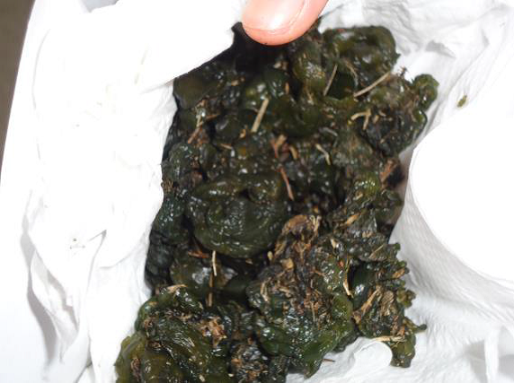
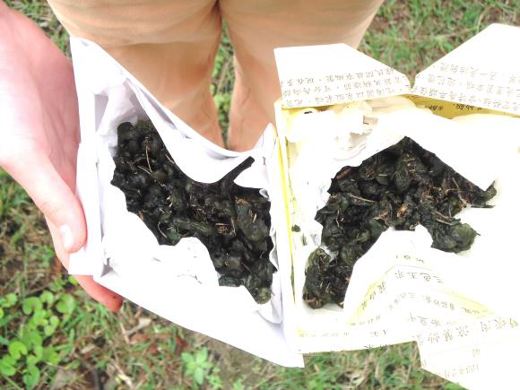

========
五年二班
========

<雨來菇> 林韋均、謝秀萍
=======================
很多人都以為操場上黑黑的是大便，但絕對不是。其實他的真面目是傳說中的《雨來菇》。雨來菇被發現在世界各地的許多國家。它能夠生存在極端的條件下，它是一個陸地或淡水物種和形式鬆散的團塊對土壤碎石鋪成的表面，在苔蘚和鵝卵石之間在新加坡，木耳生長在鹼性土壤中、苦鹹水、稻田、懸崖上、潮濕的岩石上。雨來菇在不利條件下，可以保持一段較長的時間處於休眠狀態，形勢好轉時再予恢復。如果想找，操場裡的草坪有許多雨來菇，讓你採都採不完。不過雨來菇只有雨後才會長出來，過太久就會乾乾扁扁的，這樣就不新鮮了。

<校園最美的角落> 蔡鈞任
=======================
「基隆河畔，蒼松翠柏，我愛濱江，美麗的校園......」校歌中，在在明我們學校的美。在學校，每當下課時，操場總是水洩不通，大家都很喜歡在操場上，揮灑汗水，散發青春活力。可是，操場是只是我其次喜歡的地方。校園最美的角落，我個人覺得是生態池。從小一入學開始，我就對生態池抱持著很大的興趣，很想去一探究竟，可是，因為那裡水深危險，且水質不好。所以，直到五年級第一次踏進整修後的生態池時，我感到不可思議，那裡有如世外桃源一樣綠意盎然，配上蟲鳴鳥叫，使人格外輕鬆，生態池是校園內最親近大自然的地方，希望大家可以多多來這裡觀察動植物，暫時遠離外界，沉浸在大自然中。

<評 西遊記> 藍翊宸
==================
《西遊記》這本書深受大家喜愛，是四大名著之一，訴說很多種不同的情緒以及師父和師弟間的感情。這本書寫了她們師徒四人雖然經過風吹雨淋和妖怪的攻擊，但他們還是勇於克服，讓我學習到堅持與勇敢的珍貴。書中主角孫悟空雖然過於自大，但了解自己的使命，因此保護唐僧度過重重難關。故事裡的四人雖然有時會犯錯，但都能互相包容，值得學習。

<「比中指」為什麼是罵人的意思？> 李家皓
=======================================
從開學以來，我常常看到有學長姊在「比中指」，但許多人都不知道「比中指」的義意，就藉由這機會來跟大家講比中指的出處吧！

其中一個說法是這樣的：眾所周知英國和法國一向來不合，其實真正的情況我也不大清楚，只知道英國的第一任國王其實是法國的貴族，歷史上這兩國打了不少仗。有一次這兩國又打仗了，當時的英國部隊有一項非常令他們引以為榮的長弓，叫“BRITISH LONG BOW”──英國長弓。其用法的特點是非常依賴中指的力量，這種弓箭的射程非常遠，在當時可說是最先進的技術，是英國的最厲害的武器。

法國對這樣的情況顯得很不耐煩，其中的一位將軍最先發話，說一旦他們打勝仗，他將把英國軍人的中指給切下來，這句話讓英軍耿耿於懷，更加小心應戰。結果，英軍贏了。為了表示歡慶，英軍就故意比出自己仍然存在的中指給戰敗的法國軍人看，用這個方式來羞辱戰敗的軍人。就這樣，比中指被普遍的應用起來了。

另一個說法是：根據古羅馬文獻記載，比中指被視為侮辱人的手勢。此手勢很像erect penis，古羅馬視erect penis的image為對抗邪惡法術的護符。因此，向他人比中指在當時並無sexual insult的意思，而是取笑以大欺小或無力面對公平競爭的人。

無論是哪個傳說，比中指都有挑釁和惡意取笑他人的意思，所以請大家不要比中指。

<情境中心> 程堯
===============
在我們就讀的濱江國小裡，有一個獨一無二的大教室，那就是特殊的英語情境中心。

我開始知道有英語情境中心是一年級的時候，而設立英語情境中心的原因是老師們想要讓學生有跟外國人接觸的機會，並獲得更多的英文知識。

情境中心的教室有11間，各個情境都很有趣，老師也都很親切，因此很多學生都喜歡上這個課程。

情境中心是校內不可或缺的學習場所，因為我們要在那裏學習英文及練習生活上的種種對話，而它提供我們一個全英文的環境。

因為情境中心的教學很完整，所以我們要把它留著，讓未來的學生也能夠學習英語。只要你能專心聽講，並善加利用情境中心提供的資源，多加練習，相信你的英文一定可以越來越好。

<社論「苑裡風車事件」> 張詠菘
=============================
「抗議！抗議！」繼服貿之後，又有人到行政院抗議，為的是自己的健康。苗栗縣苑裡鄉的民眾已經受不了風力發電的機器對身體的危害，於是上行政院抗議，還有人一度中暑。苗栗縣長劉政鴻說：「風力發電是為了環保，苑裡非常適合，所以蓋在苑裡。」這些話卻引起民怨。我阿公的母親就住在苑裡，回去探望時，總是會看到風車，其實真的很吵，希望它可以改進，別再那麼吵了......

<論行善> 林竺瑩
===============
「笑」會傳染；「病」會傳染；「打嗝」也會傳染。那為什麼做善事不能傳染？其實是可以的！一個人做，人就會跟著做；相反的，沒人先做，就沒有人做。所以所有人一定都有被第一人影響過。如果把這種方式套用在我們班上，只要其中一人做，就可以影響其他二十五人，那為何不做？原因我想只有兩個：一、沒有人願意當「第一人」。二、沒人「發現」第一人，大家都各顧各的。當然我希望當「第一人」，所以我要更努力，讓我們班不要成為自私的班。

<看電影> 謝佳軒
===============
就在上星期四時，我在第六十一臺看到了「世界第一麥方ㄆㄤˋ」這一部電影，是改寫吳寶春師傅從小到大的經歷，也包括了吳寶春師傅的愛情，和吳寶春師傅是怎麼從麵包學徒一步一步慢慢的變成師傅,到最後出國比賽拿冠軍的事件。

這部電影的尾段時，出現了之前在上課時有提到的「風車」，當我一看到風車，就想到了風車那麼大、居住在那裡的居民應該會很不方便吧？因為風車很大,而且聲音又很大很吵。

最後，我覺得風車的好處是風力發電。但是風車的壞處就是聲音吵、離居民居住地方很近，會導致居住在那裡的居民失眠、頭痛、失去活力等等的症狀。如果能移離有人居住的地方，就能既發電又不會製造噪音了。

<騎腳踏車> 林威郡
=================
在過年的最後一天，叔叔、哥哥、爸爸帶我去騎腳踏車，一大早我們就起床，目標是高雄的中寮山，這是我第一次挑戰山路，因此心裡有一點擔心及緊張，但是我決定挑戰看看。一開始我還不熟悉車上的變速器，所以踩起來很費力，加上沿路都是上坡，讓我幾乎不能再動了，很想要放棄，後來爸爸教我如何使用變速器及不斷的鼓勵我，才讓我漸入佳境。經過一段時間的努力，全身充滿了汗水，終於快到達山頂，看見家人在不遠處迎接我，終於我到達了山頂，我的心裡非常高興，大家也都為我鼓掌，山頂的風景一覽無遺，有花有草及許多大大小小的房子，接下來又要面臨下坡的挑戰，在下坡爸爸一直提醒煞車不能放開，雖然手很痠，但是比上坡輕鬆多了，很快的就到山下也讓我鬆了一口氣。這次的經驗讓我覺得意猶未盡，我克服了困難，家人也為我感到驕傲，我下次還想再去。這學期有小鐵人的活動，也鼓勵大家遇到困難不要放棄，堅持下去，一定會有好成果！

<日行二善的聯想> 陳庭安
=======================
日行二善，也許我們大家都不太了解，但我還是要發表一下我的想法！對我來說，日行二善就是在別人需要幫助時，馬上伸出援手。但聽完老師明確的講解後，我好像搞錯了！日行二善其實不是這麼簡單的意思。幫助人是要發自內心；自己開心時，要顧慮到別人的感受；我們處處都要為別人著想，而不是只為自己著想；幫助人是不論喜歡或討厭的人都要幫，而不是只幫助自己喜歡的人，這才叫做「日行二善」！像有時候，我會幫忙發簿本，或有時同學在工作或體育上需要協助我就會盡力的去幫助他們；有時有人在路上掉了東西，我就會鼓起勇氣拿給他們。只要有一份心，社會就多一份愛。

