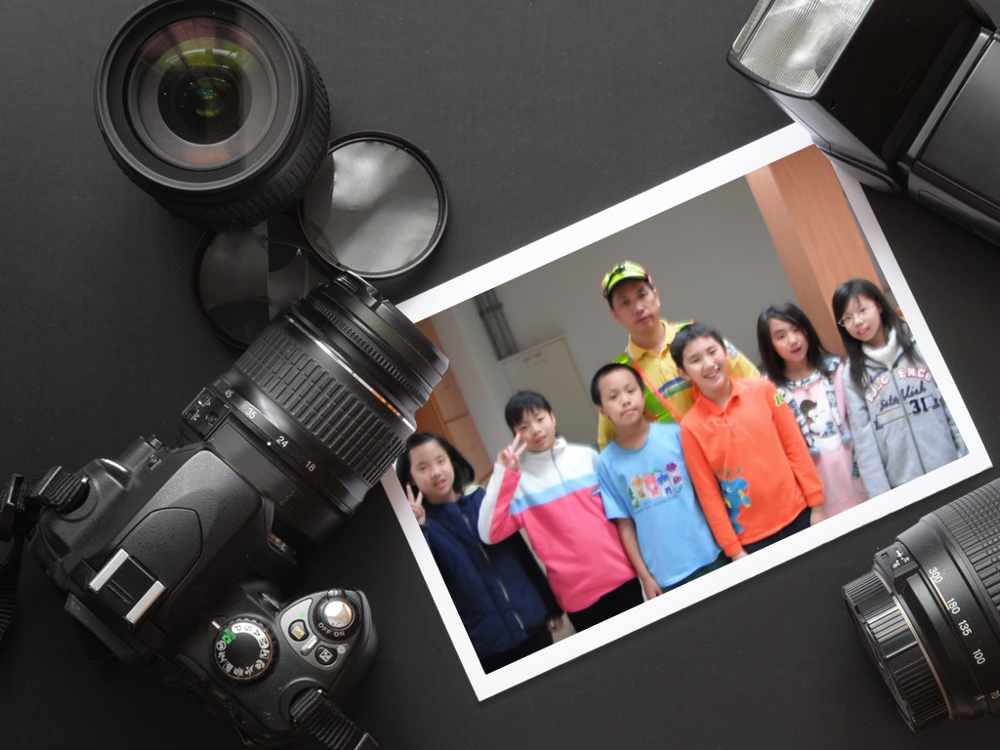
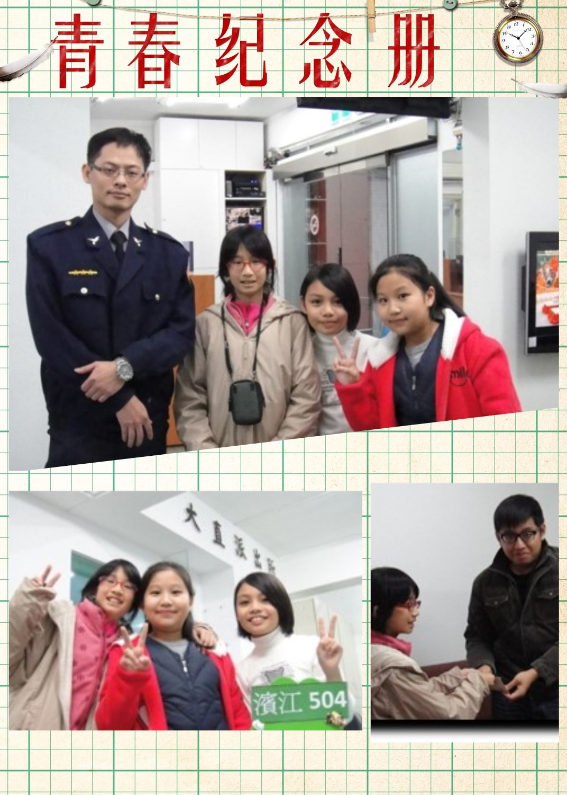

========
五年四班
========

專題名稱–熱心的環保人員
=======================
環保人員訪談紀實

訪問對象：許哲維爸爸

時間：12月12日，中午12點40分～1點10分

地點：濱江國小五年級教休室

記者：全組

紀錄者：吳艾霖、廖珮庭

珮庭：您好，我們是濱江國小5年4班的小小記者，因為我們要做採訪報告，所以想問您們工作上的幾個問題。

哲維爸爸：好，可以呀！

哲維：我們要訪問的問題，第一個是為什麼您想要從事這份工作？

哲維爸爸：因為這份工作是我得到消息之後去報考，因為它是儲備的清潔隊員，等了兩年才正式進入環保局服務，我覺得這份工作收入很穩定，工作性質也蠻適合我本人，所以我很喜歡這份工作。

哲維：這份工作跟一般上班族有甚麼不一樣的地方嗎？

哲維爸爸：環保局的工作就我自己個人而言，我們上班時間是下午的三點半到晚上的十一點半，那跟一般正常的上班族是不太一樣的時間，因為上班族的時間都是早上九點上班或是八點上班到下午五點或六點下班，那我們一天收集垃圾的或資源回收的工作比較有點像小夜班，因為要到晚上十一點半才下班，所以不同的地方應該就在這。

哲維：這份工作最大的挑戰性在哪裡？

許哲維爸爸：其實這份工作說挑戰性也倒還好，因為工作的內容都是面對台北市市民，所以其實可能最大的挑戰工作就是面對市民們，因為要跟老百姓第一線接觸，有很多老百姓不諒解為甚麼這個有收那個沒收，或是為甚麼這個時間是收這個，那個時間收那個資源回收，不一樣的東西為什麼要分開來，其實如果做好環保每一項工作對我們大家都是很有幫助的。

哲維：工作中您曾經碰過什麼事讓您非常棘手，那您如何來克服或化解？

哲維爸爸：其實對於工作上棘手的問題，倒不是很常見，可能覺得有時候老百姓沒做好分類工作或是沒有用垃圾袋就想要丟垃圾，這是我們不同意的，我也希望說你們回去能跟爸爸媽媽講做好分類的工作，其實是很有幫助的。

哲維：工作的這段期間，有無讓您印象最深刻的事情？請您舉例說明。

許哲維爸爸：我覺得印象深刻的事，因為很多爺爺奶奶或是小朋友都很喜歡做分類的工作，會到廚餘桶或是垃圾車的旁邊看，想說為什麼要做這些事情，那這些事情對他們又有甚麼幫助，其實我覺得小朋友也很好奇，我希望你們可以瞭解說為甚麼又做環保為甚麼又分類，甚麼是垃圾甚麼是資源垃圾，甚麼是可以再利用的，我覺得小朋友你們要徹底去瞭解，這對你們長大對環保都是有很大的幫助。

哲維：每一份工作都非常神聖，就環保方面，那您有沒有呼籲人們應該配合與注意的地方？

哲維爸爸：其實我覺得工作沒有分貴賤，或許你會說垃圾車開過你經過的地方你會覺得很臭，那為甚麼垃圾會很臭？你如果把垃圾和資源回收分類好就不會有這些問題，那當然我們都不喜歡垃圾場在我們家附近，這也是沒辦法的，因為有人類的地方就會有垃圾，希望你們以後能做好分類，向下扎根，從這一刻開始做起。

哲維：以上就是我們的訪問，謝謝。

認識波麗士大人─警察局訪談記實
=============================
訪問對象：張育瑞警員

時間：12月10日星期二

地點：大直分局

記者：李沐恩

沐恩：我們是濱江國小五年四班的濱江小記者：李沐恩、羅姵勛和陳煒欣，我們有一些問題要問您，請問先生貴姓？

警員：我姓張，弓長張，名叫做育瑞，你們好！

沐恩：好，請問當警察要具備那些條件？

警員：要有熱心、有耐心。

沐恩：請問您們平常的工作內容是甚麼？

警員：工作內容就是巡邏，你們平常看到我們騎著機車在那邊繞，然後就去查戶口、去別人家做拜訪、維持交通，大概這樣子。

沐恩：請問您們平常是如何訓練、維持技能的？

警員：因為上班時間比較忙，所以通常就是下班後自己去跑跑步、游泳，先盡量維持一下自己的體能，就是自行做訓練。

煒欣：那平常會有體能訓練嗎？

警員：也很少，大部分都要靠自己！

沐恩：請問您是否可以舉例說明比較溫馨感動的案子？

煒欣：就像是老太太呀！說要找自己兒子啊！那一類的。

警員：有啊！以前就是有一個老太太一個人晚上在路上，因為那時候是冬天，很冷，我們就看到她一直在路上走來走去，然後我們就一直問她，可是她是老人癡呆，記不太起來，也不知道自己的名字、還是她兒子，然後我們就一直問，就是從她身上有問到一些資訊，她就稍微講了一下她的名字，然後就是用我們的電腦去查，查到之後就再去通知她的家人，那時候其實她的家人也有在外面找，因為老人家嘛，又冬天，對他們身體不好，找到之後，自己也是蠻感動的，畢竟我們自己家裏也是有大人、有長輩的，老人家常失蹤，這也是蠻困擾的，所以回來之後看到他們一家人這樣，去了也是覺得蠻溫馨的。

沐恩：那請問您們有沒有處理過最危險的案子，請舉例說明一下。

警員：那時候我還沒有在這間派出所，在別間派出所的時候，有人開槍，我們有找到嫌疑犯，就去他家附近做埋伏，因為那時候不知道他身上有沒有槍，所以就在那邊等他出來，不過到最後還是沒出現，後來是有別的同事在別的地方抓到他，他身上就是有槍。

沐恩：我覺得當警察是一件很危險的工作，那請問您是抱持什麼樣的心情去從事這個工作？

警員：就是服務社會，因為有很多事情一般人不會想去做。

沐恩：那請問您的家人是如何看待您的工作？

警員：其實他們也覺得這個工作不錯，可以服務社會上的大眾，但是他們也覺得這個工作很危險，也會叫我上班要多注意安全。

沐恩：好，謝謝您，我們的問題問完了！

金泰里里長訪談紀實
==================
地點：金泰里里長辦公室

時間：民國一百零二年十二月十一日

記者：何浩睿、吳豐安

紀錄：Vito

吳豐安：里長您每天需要做什麼工作？

里長：每天需要在辦公室服務人民，像濱江國小對面的路燈被卡車撞到，我就要去處理。

吳豐安：里長您為什麼要來這裡工作呢？

里長：因為對重化區的大直比較有興趣，在濱江國小的師資很好，所以對濱江國小的幫助很大。

何浩睿：里長您對社區有什麼想法？

里長：我在基河國宅的生活機能很好，這裡交通很便利，可以到很多地方。現在我想處理塞車的問題，使交通更方便。

吳豐安：里長您想要建設我們的社區？

里長：我們的社區以前是政府的，現在已變成社區公園。

何浩睿：您喜歡這個工作嗎？

里長：我喜歡這個工作，雖然工作從九點到二十二點很辛苦，但是為民服務很開心。

游泳池救生員訪談紀實
====================
訪問對象：游泳池救生員

時間：102年12月14日下午3點

地點：采堤游泳池

記者：吳奇叡

紀錄者：李瑋軒、王識傑

影像紀錄者：林以偲、王顥

吳奇叡：您為什麼要當這裡的救生員?

救生員：因為我在外面考到許多有關救生員的證照，讓我的證照有一些發揮的作用。

吳奇叡：您在采提游泳池工作多久了?

救生員：我在采提工作將近兩個多月，之前我有在一間飯店的游泳池工作，所以我在游泳池區塊待大概了六年的時間。

吳奇叡：這個工作平常會發生什麼問題?

救生員：平常比較多的問題就是一些小朋友來游泳池比較不清楚規則，我們會告訴他規則，預防一些意外的發生。比如說: 跳水及在游泳池旁邊跑步會跌倒受傷，這些我們都要告知他讓他知道游泳池是一個危險的地方，不能當成一般的運動場所來運動，一定要守規則。

吳奇叡：您是如何解決這些問題的?

救生員：通常是我們會口頭告訴他一些規定，我們也有一些告示牌，告訴他們使用規定，當每件事情發生後，我們第一時間會口頭告訴他們一些危險性和一些預防還有該如何遵守一些規則。

吳奇叡：您喜歡這份工作嗎?為什麼?

救生員：我喜歡這份工作，因為有機會可以接觸到教小朋友游泳部分，當然是希望會游泳的小朋友越來越進步。

吳奇叡：您希望這份工作未來的展望?

救生員：我希望被我教過游泳的小孩，能夠在溪流或海邊時，能夠自救，或許他們以後能像我一樣，當個救生員幫助更多人。

